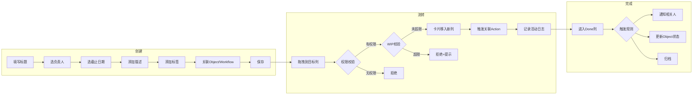
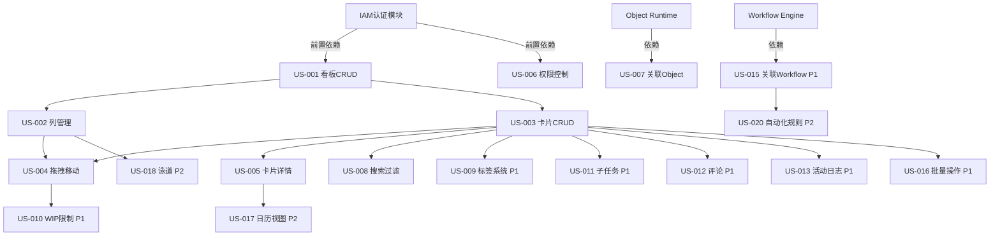

# PRD-021: 看板管理平台（Kanban Board Platform）

## 版本历史
| 版本 | 日期 | 修改人 | 修改内容 |
|------|------|--------|----------|
| V1.0 | 2026-06-16 | ECOS-PM | 初稿 |

---

## 1. 概述

### 1.1 产品定位

看板管理平台是ECOS企业认知操作系统中的**可视化任务/工作项管理组件**。它提供拖拽式看板视图，让用户可以直观地管理工作项（任务/案例/审批/Kanban卡片）的生命周期流转。

### 1.2 在ECOS架构中的位置

```
Mission Control（任务指挥中心）
    └─ Kanban Board Platform ← 新模块
          ├─ 借力：Object Runtime（卡片数据存储）
          ├─ 联动：Workflow Engine（状态流转触发）
          ├─ 联动：Agent Runtime（智能任务分配）
          └─ 依赖：IAM（权限控制）
```

### 1.3 核心价值

1. **可视化工作流** — 将抽象的任务状态变成直观的看板列，一目了然
2. **拖拽流转** — 改变卡片列位置即触发状态变更，降低操作成本
3. **可配置性** — 不同业务场景自定义看板结构（列数/列名/WIP限制）
4. **深度集成** — 卡片可关联 ECOS Object、Workflow、Agent、Mission

### 1.4 竞品对标

| 维度 | Jira | Trello | Notion DB | ECOS Kanban |
|------|------|--------|-----------|-------------|
| 目标用户 | 研发团队 | 个人/小团队 | 知识工作者 | 政务/企业全场景 |
| 可配置列 | ✅ | ✅ | ✅ | ✅ |
| WIP限制 | ✅ | ✅ | ❌ | ✅ |
| 卡片字段自定义 | ✅ | ✅ | ✅ | ✅ |
| 关联Object/Workflow | ❌ | ❌ | ❌ | ✅ ECOS差异化 |
| Agent智能分配 | ❌ | ❌ | ❌ | ✅ ECOS差异化 |
| 政务合规(信创/等保) | ❌ | ❌ | ❌ | ✅ ECOS差异化 |

---

## 2. 用户故事

### 2.1 角色定义

| 角色 | 描述 | 典型使用场景 |
|------|------|-------------|
| 业务负责人（Board Admin） | 创建和管理看板，定义列结构和工作流 | 设置「供应商准入看板」的审核列 |
| 业务执行者（Board Member） | 在看板上管理自己的工作项 | 将待审核供应商卡片拖入「审核中」列 |
| 观察者（Viewer） | 只读查看看板状态 | 领导查看当前供应商准入进度 |
| 系统管理员（Sys Admin） | 全局看板资源配置和权限管理 | 配置看板模板，设定跨部门共享权限 |

### 2.2 用户故事清单

#### P0 — 核心能力

**US-001: 创建看板**
> **As a** 业务负责人
> **I want** 创建一个新的看板，配置标题、描述和初始列结构
> **So that** 我可以为特定业务流程建立可视化管理工作区

**US-002: 管理看板列**
> **As a** 业务负责人
> **I want** 在看板中添加/编辑/删除/排序列，并设置列的颜色和WIP限制
> **So that** 看板能匹配我的实际业务流程阶段

**US-003: 创建卡片**
> **As a** 业务执行者
> **I want** 在看板的目标列中快速创建卡片，填写标题、描述、负责人、截止日期
> **So that** 我能将工作项录入看板开始跟踪

**US-004: 拖拽移动卡片**
> **As a** 业务执行者
> **I want** 通过拖拽将卡片从一个列移动到另一个列
> **So that** 我可以直观地更新工作项的状态

**US-005: 查看卡片详情**
> **As a** 业务执行者
> **I want** 点击卡片打开详情面板，查看/编辑完整信息
> **So that** 我能在同一个页面完成所有操作而无需跳转

**US-006: 看板权限控制**
> **As a** 系统管理员
> **I want** 按角色（Admin/Member/Viewer）控制用户对看板的访问权限
> **So that** 敏感业务流程的信息不会泄露给无关人员

**US-007: 关联ECOS Object**
> **As a** 业务负责人
> **I want** 看板卡片关联到ECOS Object Runtime中的业务对象（如供应商、合同）
> **So that** 卡片状态变更可以同步更新业务对象的生命周期

**US-008: 搜索与过滤**
> **As a** 业务执行者
> **I want** 按负责人、标签、截止日期、关键词等条件过滤看板卡片
> **So that** 我能快速找到关注的工作项

---

#### P1 — 重要增强

**US-009: 卡片标签系统**
> **As a** 业务执行者
> **I want** 为卡片添加/管理标签（如「紧急」「高优」「待确认」）
> **So that** 我能快速标记和筛选不同类型的卡片

**US-010: 列WIP限制警告**
> **As a** 业务负责人
> **I want** 当某列卡片数量达到WIP上限时系统给出视觉警告
> **So that** 团队不会在某环节堆积过多工作项

**US-011: 卡片子任务**
> **As a** 业务执行者
> **I want** 在卡片内创建子任务清单并逐项勾选完成
> **So that** 我能在卡片级别跟踪细粒度的工作进度

**US-012: 评论与@提及**
> **As a** 业务执行者
> **I want** 在卡片上添加评论，并通过 @ 提及通知其他成员
> **So that** 我能在卡片上下文中进行协作沟通

**US-013: 活动日志**
> **As a** 业务负责人
> **I want** 查看卡片的完整活动日志（创建/移动/编辑/评论等）
> **So that** 我能审计工作项的完整变更历史

**US-014: 看板复制与模板**
> **As a** 业务负责人
> **I want** 将已有看板保存为模板，或从模板创建新看板
> **So that** 标准流程可以快速复用到多个业务场景

**US-015: 卡片关联Workflow**
> **As a** 业务执行者
> **I want** 从卡片触发关联的ECOS Workflow（如「发起供应商审核流程」）
> **So that** 看板可以驱动实际的业务流程执行

**US-016: 批量操作**
> **As a** 业务执行者
> **I want** 批量选择多张卡片，统一移动列/修改负责人/添加标签
> **So that** 我能高效处理大量工作项的批量变更

---

#### P2 — 锦上添花

**US-017: 看板日历视图**
> **As a** 业务执行者
> **I want** 切换到日历视图，按截止日期查看卡片分布
> **So that** 我能更好地做时间规划

**US-018: Swimlane泳道**
> **As a** 业务负责人
> **I want** 在看板中添加水平泳道（按负责人/优先级/类型分组）
> **So that** 我能在同一看板上看到多维度的工作项分布

**US-019: 看板统计与报表**
> **As a** 业务负责人
> **I want** 查看看板的统计数据（卡片分布图/平均流转时间/阻塞率）
> **So that** 我能量化分析团队工作效率

**US-020: 看板自动化规则**
> **As a** 业务负责人
> **I want** 设置自动化规则（如「当卡片进入Done列时，自动通知相关人」）
> **So that** 减少重复操作

**US-021: 全屏专注模式**
> **As a** 业务执行者
> **I want** 切换到全屏模式
> **So that** 我能更专注地管理看板

**US-022: 看板分享与嵌入**
> **As a** 业务负责人
> **I want** 生成看板的公开链接或嵌入到统一门户中
> **So that** 非ECOS用户也能查看看板状态

---

## 3. 验收标准

### 3.1 P0（必须完成，阻塞发布）

#### US-001: 创建看板
- **GIVEN** 我是已登录的业务负责人（Board Admin角色）
  **WHEN** 我点击「新建看板」按钮，填写看板名称、描述，选择初始列模板（3列/4列/5列/自定义）
  **THEN** 系统创建一个新看板，自动生成所选模板的初始列，并跳转到新看板页面

- **GIVEN** 看板名称为空
  **WHEN** 我点击「保存」按钮
  **THEN** 系统提示「看板名称不能为空」，保存失败

#### US-003: 创建卡片
- **GIVEN** 我处于目标看板页面
  **WHEN** 我点击列底部的「+ 添加卡片」按钮，输入标题，选择负责人
  **THEN** 该列新增一张卡片，标题可见，负责人头像显示在卡片底部

- **GIVEN** 卡片标题为空
  **WHEN** 我点击「保存」
  **THEN** 系统提示「卡片标题不能为空」

#### US-004: 拖拽移动卡片
- **GIVEN** 我处于看板页面
  **WHEN** 我从列A拖拽一张卡片到列B
  **THEN** 卡片立即移动到列B，卡片内记录状态变更时间戳和操作人

- **GIVEN** 目标列已达到WIP上限（如有设置）
  **WHEN** 我尝试将卡片拖入该列
  **THEN** 拖拽被拒绝，系统显示「该列已达WIP上限」提示

#### US-006: 看板权限控制
- **GIVEN** 我是系统管理员
  **WHEN** 我进入看板设置-权限页面，为角色选择「Admin/Member/Viewer」并保存
  **THEN** 权限立即生效：Admin可配置看板，Member可操作卡片，Viewer仅可查看

- **GIVEN** 当前用户为Viewer
  **WHEN** 我尝试拖拽卡片
  **THEN** 拖拽操作被禁用，鼠标指针显示禁止图标

#### US-007: 关联ECOS Object
- **GIVEN** 我处于卡片编辑面板
  **WHEN** 我从Object选择器中选中一个业务对象（如供应商实体）
  **THEN** 卡片显示关联的对象名称/图标，点击可跳转到对象详情页

- **GIVEN** 卡片关联了Object
  **WHEN** 卡片移动到「审核通过」列
  **THEN** 关联的Object状态自动更新为对应状态（如Supplier.status = "approved"）

### 3.2 P1（重要，不影响发布）

#### US-009: 卡片标签系统
- **GIVEN** 我处于卡片编辑面板
  **WHEN** 我输入标签名称（如「紧急」「高优」）并确认
  **THEN** 卡片上显示对应颜色的标签，标签统一管理在标签库中

#### US-012: 评论与@提及
- **GIVEN** 我打开卡片详情
  **WHEN** 我在评论框中输入内容并提交
  **THEN** 评论出现在卡片活动日志中，显示提交人和时间

- **GIVEN** 评论中包含 @某人
  **WHEN** 我提交评论
  **THEN** 被@的用户收到系统通知

### 3.3 P2（锦上添花）

#### US-017: 看板日历视图
- **GIVEN** 我处于看板页面
  **WHEN** 我点击右上角的「日历」视图切换按钮
  **THEN** 卡片按截止日期分布在日历格中，无截止日期的卡片在底部
  **WHEN** 我拖拽卡片到另一个日期
  **THEN** 卡片截止日期更新为新的日期

---

## 4. 业务流程

### 4.1 正常流程：看板全生命周期


### 4.2 卡片完整生命周期



### 4.3 异常流程

| 异常场景 | 系统响应 | 用户提示 |
|----------|----------|----------|
| 网络中断导致拖拽失败 | 卡片回弹至原列，本地缓存操作 | 「网络异常，拖拽失败，请重试」toast 提示 |
| WIP超限拒绝拖拽 | 卡片不移动，列边缘闪烁红色 | 「列「审核中」已达 WIP 上限 (3)，请先完成当前卡片」 |
| 权限不足尝试操作 | 操作按钮禁用/隐藏 | 无提示（Viewer看不到操作入口） |
| 关联Object已被删除 | 卡片显示「对象已删除」灰色标识 | 预览显示「关联对象不存在，请更新」 |
| 并发操作同一卡片 | 后提交的操作失败，刷新后自动更新 | 「该卡片已被他人更新，请刷新后重试」 |
| 卡片标题超长 | 自动截断，详情中完整显示 | 标题输入框限制100字符，超出后无法输入 |

### 4.4 状态机定义

```
卡片状态： 列1 → 列2 → 列3 → ... → Done列（终态）
              ↘  ↙  ↘  ↙
            用户自定义任意状态流转
            支持：前移 / 回退 / 跳过

卡片子状态：
  - active: 未在Done列
  - done: 在Done列
  - archived: 手动归档后
```

---

## 5. 界面原型

### 5.1 整体布局

```
┌─────────────────────────────────────────────────────────┐
│ [←返回] 供应商准入看板    [🔍搜索...]  [新建卡片] [⚙设置]│
├─────────────────────────────────────────────────────────┤
│                                                         │
│ ┌──────────┐ ┌──────────┐ ┌──────────┐ ┌────────────┐  │
│ │ 待处理    │ │ 审核中   │ │ 待签约   │ │ ✅ 已完成  │  │
│ │ 3         │ │ 2        │ │ 1        │ │ 5          │  │
│ ├──────────┤ ├──────────┤ ├──────────┤ ├────────────┤  │
│ │ ┌──────┐ │ │ ┌──────┐ │ │ ┌──────┐ │ │ ┌────────┐ │  │
│ │ │卡1   │ │ │ │卡4   │ │ │ │卡6   │ │ │ │卡7     │ │  │
│ │ │负责人A│ │ │ │负责人B│ │ │ │负责人C│ │ │ │负责人A │ │  │
│ │ │高优🔥 │ │ │ │ 🔔待批│ │ │ │      │ │ │ │        │ │  │
│ │ └──────┘ │ │ └──────┘ │ │ └──────┘ │ │ └────────┘ │  │
│ │ ┌──────┐ │ │ ┌──────┐ │ │          │ │ ┌────────┐ │  │
│ │ │卡2   │ │ │ │卡5   │ │ │          │ │ │卡8     │ │  │
│ │ │负责人B│ │ │ │负责人A│ │ │          │ │ │负责人D │ │  │
│ │ │ 📎关联 │ │ │ │ ⏰明天 │ │ │          │ │ │        │ │  │
│ │ └──────┘ │ │ └──────┘ │ │          │ │ └────────┘ │  │
│ │ ┌──────┐ │ │          │ │          │ │            │  │
│ │ │卡3   │ │ │ [+添加]  │ │ [+添加]  │ │            │  │
│ │ │负责人C│ │ │          │ │          │ │            │  │
│ │ └──────┘ │ │          │ │          │ │            │  │
│ │ [+添加]  │ │          │ │          │ │            │  │
│ └──────────┘ └──────────┘ └──────────┘ └────────────┘  │
│                                                         │
│ 水平滚动 ← →                                            │
└─────────────────────────────────────────────────────────┘
```

### 5.2 卡片详情面板（右侧滑出）

```
┌─── 卡片详情 ─────────────────┐
│ ✏️ [供应商星辰科技入库审核]    │
│ ┌──────────────────────────┐ │
│ │ 列表：待处理 → 审核中     │ │
│ └──────────────────────────┘ │
│                              │
│ 描述                         │
│ ┌──────────────────────────┐ │
│ │ 星辰科技新供应商首次入库  │ │
│ │ 需完成资质审核...         │ │
│ └──────────────────────────┘ │
│                              │
│ 负责人：[👤 张三]            │
│ 截止日期：[2026-06-30]       │
│ 标签：[紧急🔥] [供应商]      │
│                              │
│ ─── 关联对象 ───              │
│ 🔗 供应商-星辰科技 →跳转     │
│                              │
│ ─── 子任务 (2/5) ───         │
│ ✅ 审核营业执照               │
│ ✅ 验厂报告                   │
│ ☐ 风险评估报告               │
│ ☐ 合规审查                    │
│ ☐ 领导审批                    │
│                              │
│ ─── 活动日志 ───              │
│ 张三 移动到「审核中」 10:30   │
│ 李四 添加评论 09:15           │
│ 张三 创建卡片 昨日 16:00      │
│                              │
│ [评论...]                    │
│                              │
│ [🗑删除]    [存档]  [分享]    │
└──────────────────────────────┘
```

### 5.3 看板设置页

```
┌─── 看板设置 ─────────────────────┐
│                                  │
│ 看板名称：[供应商准入看板]         │
│ 看板描述：[管理供应商准入全流程]    │
│                                  │
│ ─── 列管理 ───                   │
│ ┌──────────────────────────────┐│
│ │ ⠿ 待处理    WIP: 5   🔴删除  ││
│ │ ⠿ 审核中    WIP: 3   🔴删除  ││
│ │ ⠿ 待签约    WIP: —   🔴删除  ││
│ │ ⠿ 已完成    WIP: —   🔴删除  ││
│ │ [+ 添加列]                    ││
│ └──────────────────────────────┘│
│                                  │
│ ─── 权限管理 ───                 │
│ | 角色 | 成员     | 权限        ││
│ | Admin| 张三,李四| 完全控制    ││
│ |Member| 王五,赵六| 操作卡片   ││
│ |Viewer| 全体成员 | 只读        ││
│                                  │
│ ─── 自动化规则 ───               │
│ 若卡片进入「已完成」列            │
│ 则：通知负责人 ✅                │
│     更新关联Object状态 ✅         │
│     发送邮件给相关人员 ✅          │
│ [+ 添加规则]                     │
│                                  │
│ [保存] [取消]                    │
└──────────────────────────────────┘
```

---

## 6. 数据需求

### 6.1 看板（Board）

| 字段 | 类型 | 约束 | 来源 | 说明 |
|------|------|------|------|------|
| boardId | UUID | PK, 自动生成 | 系统 | 看板唯一标识 |
| name | VARCHAR(100) | NOT NULL | 用户输入 | 看板名称 |
| description | TEXT | 可选 | 用户输入 | 看板描述 |
| template | ENUM('3col','4col','5col','custom') | NOT NULL, DEFAULT '4col' | 用户选择 | 初始模板 |
| createdBy | UUID | FK → User | 系统 | 创建人 |
| createdAt | TIMESTAMP | NOT NULL | 系统 | 创建时间 |
| updatedAt | TIMESTAMP | NOT NULL | 系统 | 最后更新时间 |
| isArchived | BOOLEAN | DEFAULT FALSE | 系统 | 是否归档 |
| ownerTeam | VARCHAR(100) | 可选 | 用户输入 | 所属团队/部门 |

### 6.2 看板列（BoardColumn）

| 字段 | 类型 | 约束 | 来源 | 说明 |
|------|------|------|------|------|
| columnId | UUID | PK, 自动生成 | 系统 | 列唯一标识 |
| boardId | UUID | FK → Board, NOT NULL | 系统 | 所属看板 |
| name | VARCHAR(100) | NOT NULL | 用户输入 | 列名称 |
| position | INTEGER | NOT NULL | 系统 | 列排序序号 |
| color | VARCHAR(7) | DEFAULT '#E2E8F0' | 用户选择 | 列头颜色（Hex） |
| wipLimit | INTEGER | DEFAULT NULL | 用户设置 | 在制品上限，NULL=不限制 |
| isDoneColumn | BOOLEAN | DEFAULT FALSE | 用户设置 | 是否为完成列（终态） |
| createdBy | UUID | FK → User | 系统 | 创建人 |

### 6.3 看板卡片（Card）

| 字段 | 类型 | 约束 | 来源 | 说明 |
|------|------|------|------|------|
| cardId | UUID | PK, 自动生成 | 系统 | 卡片唯一标识 |
| boardId | UUID | FK → Board, NOT NULL | 系统 | 所属看板 |
| columnId | UUID | FK → BoardColumn, NOT NULL | 系统 | 当前所在列 |
| title | VARCHAR(200) | NOT NULL | 用户输入 | 卡片标题 |
| description | TEXT | 可选 | 用户输入 | 卡片详细描述 |
| assigneeId | UUID | FK → User, 可选 | 用户选择 | 负责人 |
| dueDate | DATE | 可选 | 用户选择 | 截止日期 |
| priority | ENUM('low','medium','high','urgent') | DEFAULT 'medium' | 用户选择 | 优先级 |
| position | FLOAT | NOT NULL | 系统 | 列内排序权重 |
| linkedObjectType | VARCHAR(100) | 可选 | 用户选择 | 关联Object类型 |
| linkedObjectId | UUID | 可选 | 用户选择 | 关联Object实例ID |
| linkedWorkflowId | UUID | 可选 | 用户选择 | 关联Workflow定义ID |
| createdBy | UUID | FK → User | 系统 | 创建人 |
| createdAt | TIMESTAMP | NOT NULL | 系统 | 创建时间 |
| updatedAt | TIMESTAMP | NOT NULL | 系统 | 最后更新时间 |
| completedAt | TIMESTAMP | 可选 | 系统 | 完成时间（进入Done列时） |

### 6.4 卡片标签（CardTag & Tag）

**Tag 表：**
| 字段 | 类型 | 约束 | 说明 |
|------|------|------|------|
| tagId | UUID | PK | 标签ID |
| boardId | UUID | FK → Board | 所属看板（看板级标签库）|
| name | VARCHAR(50) | NOT NULL | 标签名称 |
| color | VARCHAR(7) | DEFAULT '#3B82F6' | 标签颜色 |

**CardTag 关联表：**
| 字段 | 类型 | 约束 |
|------|------|------|
| cardId | UUID | FK → Card |
| tagId | UUID | FK → Tag |
| PK | (cardId, tagId) | 复合主键 |

### 6.5 卡片子任务（CardChecklist）

| 字段 | 类型 | 约束 | 说明 |
|------|------|------|------|
| itemId | UUID | PK | 子项ID |
| cardId | UUID | FK → Card | 所属卡片 |
| content | VARCHAR(500) | NOT NULL | 子项内容 |
| isCompleted | BOOLEAN | DEFAULT FALSE | 是否完成 |
| position | INTEGER | NOT NULL | 排序 |
| completedBy | UUID | FK → User, 可选 | 完成人 |
| completedAt | TIMESTAMP | 可选 | 完成时间 |

### 6.6 活动日志（CardActivity）

| 字段 | 类型 | 约束 | 说明 |
|------|------|------|------|
| activityId | UUID | PK | 日志ID |
| cardId | UUID | FK → Card | 所属卡片 |
| actionType | ENUM('created','moved','updated','commented','assigned','tagged','completed') | NOT NULL | 操作类型 |
| actorId | UUID | FK → User | 操作人 |
| oldValue | TEXT | 可选 | 变更前值 |
| newValue | TEXT | 可选 | 变更后值 |
| comment | TEXT | 可选 | 评论内容 |
| createdAt | TIMESTAMP | NOT NULL | 操作时间 |

### 6.7 看板权限（BoardPermission）

| 字段 | 类型 | 约束 | 说明 |
|------|------|------|------|
| permissionId | UUID | PK | 权限ID |
| boardId | UUID | FK → Board | 看板ID |
| userId | UUID | FK → User | 用户ID |
| role | ENUM('admin','member','viewer') | NOT NULL | 角色 |

---

## 7. 非功能需求

### 7.1 性能

| 指标 | 目标 | 测量方式 |
|------|------|----------|
| 看板页面加载 | < 2s（100张卡片以内） | Lighthouse 模拟 |
| 拖拽响应 | < 100ms（拖拽开始到视觉反馈） | 手动测量 |
| 卡片移动更新 | < 500ms（拖拽放下到状态更新完成） | API 响应时间 |
| 搜索过滤 | < 1s（1000张卡片内） | API 响应时间 |
| 并发操作 | 支持 50 用户同时操作同一看板 | 压力测试 |

### 7.2 可用性

| 指标 | 目标 |
|------|------|
| 系统可用性 | 99.9%（排除计划内维护） |
| 最大数据量 | 单看板 ≤ 2000 卡片，超出建议归档 |
| 最大列数 | 单看板 ≤ 20 列 |
| 历史保留 | 活动日志保留 180 天，之后自动归档 |

### 7.3 安全

- 所有看板接口需 JWT 认证（复用 IAM 模块）
- 权限校验在 API 层和前端路由层双重控制
- 删除看板需二次确认
- 操作日志不可删除（审计需求）
- 导出功能仅 Admin 可用

### 7.4 兼容性

| 浏览器 | 版本 |
|--------|------|
| Chrome | 最新 2 个大版本 |
| Firefox | 最新 2 个大版本 |
| Edge | 最新 2 个大版本 |
| 移动端 | 响应式布局，支持平板横屏 |

### 7.5 信创适配

- 前端框架需兼容国产浏览器（360安全浏览器、奇安信可信浏览器）
- 数据存储需兼容达梦/人大金仓数据库（优先适配 PostgreSQL，后续扩展）
- 部署环境需支持麒麟OS / 统信UOS

---

## 8. 优先级

| 功能点 | 用户故事 | 优先级 | 估算(人天) | 依赖 | 备注 |
|--------|----------|:------:|:----------:|------|------|
| 看板CRUD | US-001 | P0 | 3 | IAM | 创建/编辑/删除/列表 |
| 看板列管理 | US-002 | P0 | 3 | US-001 | 增删改排序 |
| 卡片CRUD | US-003 | P0 | 3 | US-001 | 创建/编辑/删除 |
| 拖拽移动 | US-004 | P0 | 5 | US-002, US-003 | 核心交互，前端较重 |
| 卡片详情面板 | US-005 | P0 | 3 | US-003 | 右侧滑出面板 |
| 权限控制 | US-006 | P0 | 3 | IAM | Admin/Member/Viewer |
| 关联Object | US-007 | P0 | 3 | Object Runtime | 状态联动 |
| 搜索过滤 | US-008 | P0 | 2 | US-003 | 多维度筛选 |
| 标签系统 | US-009 | P1 | 2 | US-003 | 标签CRUD+筛选 |
| WIP上限警告 | US-010 | P1 | 1 | US-002 | 视觉警告 |
| 子任务清单 | US-011 | P1 | 3 | US-003 | 勾选+进度 |
| 评论@提及 | US-012 | P1 | 3 | US-003, User通知 | 协作 |
| 活动日志 | US-013 | P1 | 2 | US-003 | 变更历史 |
| 看板模板 | US-014 | P1 | 2 | US-001 | 模板CRUD |
| 关联Workflow | US-015 | P1 | 3 | Workflow Engine | 触发流程 |
| 批量操作 | US-016 | P1 | 3 | US-003 | 多选批量 |
| 日历视图 | US-017 | P2 | 3 | US-003 | 日历布局 |
| 泳道 | US-018 | P2 | 5 | US-002 | 水平分组 |
| 统计报表 | US-019 | P2 | 5 | US-003 | 看板分析 |
| 自动化规则 | US-020 | P2 | 5 | US-015, Workflow | 条件触发 |
| 全屏模式 | US-021 | P2 | 1 | US-001 | 专注模式 |
| 分享嵌入 | US-022 | P2 | 2 | US-006 | 公开链接 |

### 8.1 工作量汇总

| 优先级 | 功能数 | 估算(人天) |
|:------:|:------:|:----------:|
| P0 | 8 | 25 |
| P1 | 8 | 19 |
| P2 | 6 | 21 |
| **合计** | **22** | **65** |

### 8.2 依赖关系图



---

## 9. 集成说明

### 9.1 与ECOS现有模块的集成

| ECOS模块 | 集成方式 | 说明 |
|----------|----------|------|
| IAM (10319) | 认证+授权 | 复用 JWT/RBAC，看板级权限基于 IAM 的角色系统 |
| Object Runtime (1027) | 数据关联 | 卡片关联业务对象，状态变更回写 |
| Workflow (1029) | 流程触发 | 卡片移动可触发关联的 Workflow 启动 |
| Mission Control (10215) | Mission关联 | 看板可作为Mission的子视图，看板卡片对应Task |
| Agent Runtime (10211) | 智能分配 | Agent可自动看板卡片分配（P2规划） |
| 统一门户 (10320) | 嵌入展示 | 看板可作为门户Widget嵌入 |
| 通知系统 | 事件通知 | 卡片变更@提及、自动化规则触发的通知 |

### 9.2 对外API（供内部模块调用）

| API | 用途 | 调用方 |
|-----|------|--------|
| GET /api/boards | 获取用户可访问的看板列表 | 门户页面 |
| GET /api/boards/:id | 获取看板完整数据（含列+卡片） | 看板渲染 |
| POST /api/boards/:id/cards/:cardId/move | 移动卡片 | 拖拽操作 |
| POST /api/boards/:id/cards/:cardId/action | 触发卡片关联动作 | Workflow集成 |
| GET /api/boards/:id/stats | 获取看板统计 | 报表页面 |
| POST /api/boards/:id/export | 导出看板数据 | 导出功能 |

---

## 10. 风险与缓解

| 风险 | 概率 | 影响 | 缓解措施 |
|------|:----:|:----:|----------|
| 拖拽交互实现复杂（跨浏览器兼容） | 中 | 高 | 使用成熟的拖拽库（react-beautiful-dnd / dnd-kit），提前做技术选型评审 |
| 并发拖拽导致数据不一致 | 中 | 高 | 乐观锁+最后写入优先策略，卡片移动使用 position: float 而非 integer |
| WIP限制场景下用户体验不友好 | 低 | 中 | 提前设置占位符动画，拒绝时给出明确引导 |
| 关联Object状态回写失败 | 中 | 高 | 异步队列+重试机制，失败时记录错误日志并通知管理员 |
| 看板数据量增长导致性能下降 | 低 | 中 | 懒加载（仅加载当前可见列），Done列卡片自动归档策略 |
