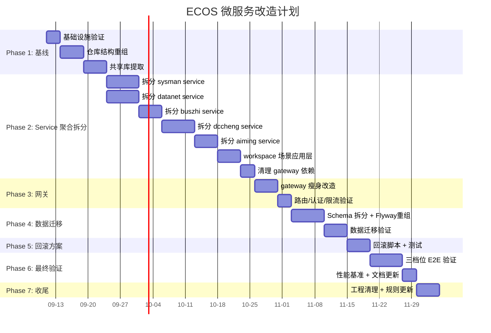

# ECOS 单体 → 微服务改造方案

> **架构铁律**: 本改造方案是对 [架构铁律](.trae/rules/架构铁律.md) 0.1 节"单体应用"的根本性修订，需同步更新铁律文档。
> **日期**: 2026-09-10
> **版本**: v1.4（workspace 独立场景应用层修订）
> **变更记录**: v1.3 → v1.4：**workspace 回归顶层独立模块**——经确认它不是某引擎的封装，而是横跨全部业务服务的综合场景应用层（对象运行时/ObjectQL/Scenario/Workbook + 场景编排，调用 sysman/datanet/buszhi/dccheng/aiming 全部服务），故保持顶层独立模块（端口 18090，`/api/v1/ecos/objects/*`、`/api/query/*`、`/api/workbook/*`）。撤销 v1.3 将其并入 buszhi 的决定。详见 §9。

---

## 1. 执行摘要

### 1.1 改造目标

将 ECOS 后端从**单一 fat-JAR（gateway）** 拆分为 **5 个独立可部署的业务微服务** + 1 个顶层 **workspace 综合场景应用层** + 1 个 API 网关（**共 6+1 个部署单元**）。六引擎（security/data/ontology/kb/cognitive/ai）作为独立可运行的引擎层保持不变，各自已有 `*-engine-boot` 模块可独立启动，生产环境由所属 service 聚合模块加载（engine-impl 作为 library）。**workspace** 不封装任何引擎，是横跨全部业务服务（sysman/datanet/buszhi/dccheng/aiming）的场景编排层，保持顶层独立模块（:18090）。

核心理念：**六引擎是"发动机"（独立能力），服务层是"底盘+车身"（业务封装 + 编排），workspace 是"整车调校"（跨域场景编排），网关是"方向盘"（路由入口）**。

- **多任务并行**: 各服务模块独立编译、测试、部署，互不阻塞
- **独立扩缩容**: 按负载特征独立伸缩
- **故障隔离**: 单服务故障不拖垮整个系统
- **三档位保持**: standard/enterprise/ultimate 三套发布模式通过服务开关控制

### 1.2 改造前后对比

| 维度 | 改造前（单体） | 改造后（微服务） |
|------|---------------|-----------------|
| 部署单元 | 1 个 fat-JAR（gateway:8080） | 5 个业务 service + 1 个顶层 workspace 场景层 + 1 个网关（共 7 个部署单元）+ 基础设施容器 |
| 编译单元 | 全量 `mvn install` | 各服务可独立 `mvn install -pl` 增量构建 |
| 故障域 | 全系统（任一模块 OOM → 整体不可用） | 单服务（可独立重启） |
| 数据库 | 共享 PG 实例，`currentSchema=public` | Schema 隔离（standard）/ 独立 Database（enterprise+） |
| 服务通信 | 进程内直接调用（Spring Bean 注入） | REST + Kafka 事件 |
| 前端代理 | `/api/*` → 8080（单端口） | nginx → api-gateway → 各服务端口 |
| CI/CD | 单条流水线 | 多流水线（按服务并行） |

---

## 2. 关键架构决策（ADR）

### ADR-1: 拆分边界 — 按业务域拆分 service 聚合，六引擎保持不变

**决策**: 以**业务域**为拆分边界，7 个业务域映射到 5 个 service 聚合模块 + 1 个 API 网关。六引擎（security/data/ontology/kb/cognitive/ai）各自作为独立可运行的 Spring Boot 服务被 service 聚合模块依赖，**不合并、不改动引擎内部结构**。

**选项分析（采纳方案 B）**:

| 方案 | 说明 | 评估 |
|:--:|------|------|
| A | 按 6 引擎拆 7 个独立部署单元 | 服务数量多，运维成本高，被业务域方案 B 取代 |
| **B（采纳）** | **按业务域拆分 service，service 封装对应引擎** | **贴合团队分工；运维成本适中；引擎独立可运行** |
| C | 按技术层拆（API层/业务层/数据层） | 违背微服务按业务拆原则 |

**方案 B 的 5 个 service 聚合 + 1 个网关（6 个引擎封装/网关单元）+ 1 个顶层 workspace 场景层（不封装引擎，独立顶层模块）**:

| 业务域 | service 模块 | 封装引擎 | 端口 | 依赖引擎（POM） | 职责 |
|:--:|:--:|:--:|:--:|:--:|------|
| a) 系统管理 | `services/sysman` | security-engine + sysman | 18081 | `security-engine-impl` | 认证/授权/审计/脱敏/ABAC/OA(阿里/Aliyun/DingTalk/WeCom SSO) + IAM/角色/字典/租户/管理面板 |
| b) 数据服务 | `services/datanet` | data-engine + ge 转化 | 18082 | `data-engine-impl` | 数据源/管道/血缘/DQ + D→I 转化（ge） |
| c) 本体服务 | `services/buszhi` | ontology-engine + zhi（KG 同步/抽取经 REST→dccheng） | 18083 | `ontology-engine-impl` | 本体建模/对象/关系/版本 + 工作流引擎 |
| d) 知识服务 | `services/dccheng` | kb-engine + cognitive-engine | 18086 | `kb-engine-impl` + `cognitive-engine-impl` | KG/RAG/规则 + 因果推理/情景模拟 + I→K（zhi）+ K→C（cheng）转化 |
| e) 智能服务 | `services/aiming` | ai-engine | 18084 | `ai-engine-impl` + `llm-gateway` | Agent/Loop/LLM 调用/Memory + K→W（ming）转化 |
| — | `gateway`（顶层，与 engine 平级） | —（纯网关） | 8080 | `common-api` + security-engine-api（认证验证） | 统一入口/路由/认证前置/限流/监控聚合 |

**引擎独立性**:
- 六引擎各自的 `api`/`impl`/`boot` 三模块结构**完全不改动**
- 各引擎的 `boot` 模块保留，仅用于引擎独立启动调试（**非生产入口**）
- 生产环境通过 service 聚合模块启动（engine-impl 作为 library 被 service 引入）
- 开发环境可用引擎 boot 独立启动 debug
- ⚠️ **端口互斥**：service 沿用其封装主引擎的端口（sysman:18081、datanet:18082、buszhi:18083、aiming:18084、dccheng:18086），本机同时运行引擎 boot 与对应 service 会端口冲突；调试时以 `--server.port` 覆盖或错开启动

**service 与引擎的关系**（POM 依赖方向）:
```
/services/sysman/pom.xml ──(depends on)──▶ engine/security-engine-impl ──▶ engine/security-engine-api ──▶ common-api
/services/datanet/pom.xml ──(depends on)──▶ engine/data-engine-impl ──▶ engine/data-engine-api ──▶ common-api
/services/buszhi/pom.xml ──(depends on)──▶ engine/ontology-engine-impl ──▶ common-api
/workspace/pom.xml ──(顶层独立场景层)──▶ 各 engine-api（仅 api 契约，跨服务调用走 REST，不依赖 engine-impl）─▶ common-api
/services/dccheng/pom.xml ──(depends on)──▶ engine/kb-engine-impl + engine/cognitive-engine-impl
/services/aiming/pom.xml ──(depends on)──▶ engine/ai-engine-impl + runtime/llm-gateway
/gateway/pom.xml ──(depends on)──▶ common-api + engine/security-engine-api (轻量，不依赖 impl)
```

**数据流**:
- 前端 → nginx → api-gateway(8080) → 路由到 6 个 service
- 每个 service 独立持有其封装引擎的 Controller/Service/Mapper
- 跨 service 同步调用走 REST（如 data-service 调 security-service 加密）
- 跨 service 异步事件走 Kafka（PipelineEvent）

> **拆分口径统一**：微服务部署单元 = **5 个业务 service（sysman / datanet / buszhi / dccheng / aiming）+ 1 个 gateway** = **6 个引擎封装/网关 JAR**，均在 `services/` 下（与 `engine/`、`runtime/` 平级）；另有 **1 个顶层 `workspace` 场景应用层**（不封装引擎、不占业务 service 编号）。旧口径中出现的"7 个"（含 core-service / api-gateway 两个独立计数）均为早期草案残留，**以此表为准**。
>
> **workspace 场景应用层（独立顶层模块，不占 service 编号）**：`workspace` 是**综合场景应用层**——对象运行时（ObjectAction/Object/ObjectQL/Scenario/Workbook）+ 工作区场景编排，会**调用下列全部业务服务**（sysman 鉴权、datanet 数据、buszhi 本体、dccheng 知识/推理、aiming 智能）。因其跨全部业务域、无单一归属，**不作为任何 engine 的封装，保持顶层独立模块**（与 `engine/`、`services/`、`gateway/` 平级），端口 **18090**。其 Controller 路径 `/api/v1/ecos/objects/*`、`/api/query/*`、`/api/workbook/*`、`/api/v1/workspace/*`，网关独立路由至 18090。它依赖 `common-api` + `ecos-shared-lib` + 各 engine-api（跨服务调用统一走 REST，不直调 engine-impl）。

### ADR-2: 服务间通信 — REST 为同步通道，Kafka 为异步事件通道

**方案 A（采纳）**: 同步调用用 REST，异步事件用 Kafka。

- 同步调用：存量 `RestTemplate` 不动；**新增跨服务调用统一用 `RestClient`**（SB 3.2 原生同位替代，RestTemplate 已处维护模式）
- 调用凭证：在线链透传用户 JWT，后台链用服务凭证（见 ADR-7）
- 异步事件：通过 Kafka topic 传递 `PipelineEvent`；topic 名以 common-api `KafkaTopics` 常量为准（`ecos.identity`/`ecos.catalog`/`ecos.ontology`/`ecos.object`/`ecos.workflow`/`ecos.agent`/`ecos.knowledge`/`ecos.audit` + 新增 `ecos.security`）；幂等/重试/DLQ 契约见 [api-contract.md](api-contract.md) §5
- 超时与重试：connect timeout 3s / read timeout 10s；关键调用加 `@Retryable`（Failsafe）
- 熔断：`resilience4j` CircuitBreaker（Spring Cloud BOM 已管理）
- 🔴 **sysman 热点缓解（强制）**：所有引擎数据访问须过 sysman 安全裁决（铁律 §2.4），拆分后每次查询多一跳 REST，sysman 将成为同步扇入热点。要求：RLS/CLS/mask/OPA 决策结果在**调用方本地缓存**（Caffeine，键 `resourceType+userId`，TTL 30s~5min），并消费 `ecos.security`（权限失效广播，KafkaTopics 新增常量）主动失效，目标削减 sysman 裁决 QPS 90% 以上
- ⚠️ **事件总线现状**：`PipelineEvent` 全仓 production 引用仅 1 处、listener 尚缺（common-api AGENTS.md 已记 P2-4 缺口）——微服务化的事件契约属**新建实现**而非迁移存量，api-contract §5 为目标态契约

### ADR-3: 数据隔离策略 — 三档差异化

**方案 A（采纳）**:
- **standard 档**: 共享 PG 实例 + Schema 隔离（`currentSchema` 参数）
- **enterprise/ultimate 档**: 每 service 独立 PG database

**Schema 命名（按 service 聚合）**:

| service | standard 档 schema | enterprise+ 档 database |
|---------|:--:|:--:|
| sysman | `security` | `ecos_security` |
| datanet | `data` | `ecos_data` |
| buszhi | `ontology` | `ecos_ontology` |
| dccheng | `knowledge` + `cognitive` | `ecos_knowledge` + `ecos_cognitive` |
| aiming | `ai` | `ecos_ai` |
| workspace（场景应用层） | `workspace` | `ecos_workspace` |
| gateway | 无持久化 | 无持久化 |

> 注：cognitive-engine 按铁律 §3.3 不新增 DB 表（推理实时计算），`cognitive` schema 仅承载其既有少量配置/结果缓存表；Phase 4 盘点确认后若确无存量表则不创建该 schema。

**跨 service 数据**: 禁止 SQL join 跨 schema，必须通过 REST API。

### ADR-4: 共享 Library 库

**方案 A（采纳）**:
- `common-api`: 不变 — `ApiResponse`、异常层级、`PipelineEvent`/`KafkaTopics`/`EventTypes`、`IEngine` 契约
- `ecos-shared-lib`（新建）: 共享只读 DTO 快照（`BaseEntity`、`Tenant`、`User` 等跨 service 引用实体的**只读视图**）
- 🔴 **shared-lib 使用边界**：实体归属 service 是唯一写入方；其余 service 仅引用只读 DTO，经 REST + Kafka 事件维护本地副本，**禁止直写其他 service schema 的表**（防止代码级紧耦合回潮）
- `runtime-core`/`runtime-access`: library 不变，被各 service 依赖

### ADR-5: 服务发现与 API 网关

**方案 A（采纳）**: 配置驱动 + 瘦身 gateway。

- 环境变量注入：`ECOS_SECURITY_SERVICE_URL=http://sysman:18081` 等
- gateway 瘦身：保留 `VersionPrefixRewriteFilter`/`RateLimitFilter`/`QuotaFilter`/`SecurityHeadersFilter`/`GlobalExceptionHandler`
- 认证前置：gateway 校验 JWT 后 **strip 外部请求携带的 `X-ECOS-*` 头并重新注入**（防伪造，见 ADR-7），透传原始 `Authorization`
- 本地用环境变量；K8s 用 Service + DNS

### ADR-6: 三档位实现

**机制**:
- 每 service 的 `application-{standard,enterprise,ultimate}.yml`
- `ecos.edition` 控制 capability switch
- 构建时 Maven profile 选依赖集
- 三套 docker-compose：`docker-compose.standard.yml` / `docker-compose.enterprise.yml` / `docker-compose.ultimate.yml`
- 📌 术语统一：旗舰档命名统一为 `ultimate`（对齐铁律 §0.4），原 `flagship` 命名（compose 文件/配置）在 Phase 6 全量更名

### ADR-7: 服务间信任与认证模式

**决策**: 网关统一认证 + 双通道凭证 + 网络隔离。

| 通道 | 机制 |
|------|------|
| 外部 → gateway | JWT 不变（`POST /api/v1/auth/login` 签发 RS256；gateway 本地公钥验签，**不依赖 REST verify 端点**——现存 AuthController 无 verify，网关本就不需要） |
| gateway → service | 校验 JWT 后 **strip 外部 `X-ECOS-*` 头并重新注入**（防伪造）；透传原始 `Authorization` |
| service → service（在线链） | 透传用户原始 JWT，被调方按用户身份裁决——安全语义与单体一致 |
| service → service（后台链：Kafka 消费/定时任务） | 服务凭证：sysman 签发服务账号 JWT（`svc-{service}`，角色 `SERVICE`，支持轮换）；standard 档首期可用内部共享令牌（env 分发）降级实现 |
| 网络 | service 端口（18081-18086）仅容器网络/内网可达，nginx 不暴露；`X-ECOS-*` 头仅在信任网络内有效 |

**各 service 侧**：新增轻量 `HeaderAuthInterceptor` 从 `X-ECOS-*` 头还原用户上下文；sysman 的内部安全端点（RLS/CLS/masking/OPA/加密）校验调用凭证，未认证默认 **DENY**（铁律 §2.4-6 不变）。

**备选方案（否决）**:
- mTLS：证书管理运维成本高，团队无相关经验，超出当前团队能力约束
- 每服务 OAuth2 client_credentials：需引入独立授权服务器，当前 6 部署单元规模下过重

**风险**: 共享令牌泄露 → 令牌仅 env 分发、不入库不入 git；轮换纳入 Runbook。

### ADR-8: 审计通道统一 Kafka

**决策**: 删除"各 service 异步 REST 调 sysman 审计端点"方案，审计统一走 Kafka。

- Topic: `ecos.audit`（common-api `KafkaTopics.AUDIT` 常量；消息格式见 [api-contract.md](api-contract.md) §5）
- 生产者: 全部 service（写操作后发事件，不阻塞主流程）
- 消费者: sysman（落库审计表）；消费失败进 DLQ，由 runtime-monitor 告警
- 既有 REST 审计端点（`/api/v1/audit`）保留一个过渡期，Phase 6 验证后下线

**理由**: 解耦（sysman 短暂不可用不阻塞业务写操作）+ 削峰 + correlationId 天然串联分布式链路。

**代价**: 审计为最终一致（秒级延迟）；铁律 §2.4-5"异步调 REST 审计端点"需同步修订（见 §8）。

---

## 3. 服务间协作关系

### 3.1 Synergetics 路线图

```mermaid
graph TB
    subgraph 前端
        FE[ecos_frontend :3000]
        NG[nginx 反向代理 :443]
    end

    subgraph API网关层
        GW[api-gateway<br/>:8080<br/>路由/认证前置/限流]
    end

    subgraph 业务服务层
        SYS[sysman<br/>:18081<br/>认证/IAM/字典/租户]
        DAT[datanet<br/>:18082<br/>数据源/管道/血缘/DQ]
        BZ[buszhi<br/>:18083<br/>本体/对象/关系/工作流]
        DCC[dccheng<br/>:18086<br/>KG/RAG/推理/规则]
        AI[aiming<br/>:18084<br/>Agent/LLM/Memory]
        WKS[workspace<br/>:18090<br/>综合场景应用层<br/>对象运行时/ObjectQL/Scenario/Workbook]
    end

    subgraph Kafka
        KFK[Kafka :9092]
    end

    subgraph 数据层
        PG[PostgreSQL :5432]
        NEO[Neo4j :7687]
        MIN[MinIO :9000]
        DOR[Doris :9030]
        OPA[OPA :8181]
    end

    FE --> NG --> GW
    GW -->|/api/v1/security/* /api/v1/audit/*<br/>/api/v1/abac/* /api/v1/data-masking/*<br/>/api/v1/data-permission/* /api/v1/policy-engine/*<br/>/api/v1/core/* /sys-man/api/*<br/>/api/v1/auth/*| SYS
    GW -->|/api/v1/engine/data/*| DAT
    GW -->|/api/v1/ecos/* (本体/关系/版本/工作流，占 /objects 之外) | BZ
    GW -->|/api/v1/knowledge/* (含 reason/rag/sync/extract/compliance-rules) /api/v1/rules/*<br/>/api/v1/cognitive/* /api/v1/world-model/*| DCC
    GW -->|/api/v1/agent/* /api/v1/agent-loop/*<br/>/api/v1/agent-mesh/* /api/v1/agent-call/*<br/>/api/v1/knowledge/*（除 reason）| AI
    GW -->|/api/v1/ecos/objects/* /api/query/*<br/>/api/workbook/* (综合场景)| WKS

    DAT -->|RLS/CLS/脱敏/OPA/加密 REST| SYS
    BZ -->|安全裁决 REST + KG 同步 REST| SYS
    DCC -->|安全裁决 REST| SYS
    AI -->|安全裁决 REST| SYS
    BZ -->|KG 同步 REST| DCC
    AI -->|推理/RAG/规则 REST| DCC
    WKS -->|场景编排调用(鉴权/数据/本体/知识/智能) REST| SYS
    WKS -->|datanet REST| DAT
    WKS -->|buszhi REST| BZ
    WKS -->|dccheng REST| DCC
    WKS -->|aiming REST| AI
    DAT -->|Kafka event| KFK
    BZ -->|Kafka event| KFK
    DCC -->|Kafka event| KFK
    KFK -->|consume| AI
    KFK -->|consume| SYS

    SYS --> PG
    DAT --> PG
    BZ --> PG
    DCC --> PG
    AI --> PG
    SYS --> OPA
    DCC -->|enterprise+| NEO
    DAT --> MIN
    DCC -->|ultimate| DOR
```

> 注：dccheng 封装 kb + cognitive 后，cognitive 调 kb 规则/图谱为**同 JVM 进程内调用**（不再是跨服务 REST）；aiming 调 dccheng 推理/RAG/规则为跨服务 REST。

### 3.2 服务间接口矩阵

| 调用方 ↓ 被调方 → | sysman | datanet | buszhi | dccheng | aiming |
|---|:---:|:---:|:---:|:---:|:---:|
| **sysman** | — | | | | ✅ agent 执行数据查询（BFF 转发，待盘点） |
| **datanet** | ✅ 安全裁决 + 加密/解密 | — | | | |
| **buszhi** | ✅ 安全裁决 | | — | ✅ KG 同步 | |
| **dccheng** | ✅ 安全裁决 | | | —（cognitive→kb 为进程内调用） | |
| **aiming** | ✅ 安全裁决 | | | ✅ 推理/RAG/规则 | — |
| **workspace(场景层)** | ✅ 鉴权 | ✅ 数据 | ✅ 本体 | ✅ 知识/推理 | ✅ 智能 |

✅ = 同步 REST 调用；空白 = 无直接调用（通过 Kafka 事件异步通信）

> **workspace 场景层**：作为顶层综合应用，**横向调用全部 5 个业务 service**（鉴权/数据/本体/知识/智能），是唯一"全连接"的调用方。因其跨全部业务域，**不封装任何 engine**，不占 5 业务 service 编号（ADR-1 说明块）。

> "安全裁决" = RLS/CLS/脱敏/OPA/审计（铁律 §2.4），全部 service → sysman；决策结果须本地缓存（ADR-2），审计走 Kafka（ADR-8，不在本表）。

---

## 4. 非功能需求（NFR）

| NFR | 要求 | 实现方式 |
|-----|------|---------|
| 部署 | Docker Compose（本地）+ K8s（生产） | 每 service 独立 Dockerfile；三套 compose 文件 |
| 隔离级别 | 每 service 独立 Spring Boot JAR | 5 业务 service + 1 顶层 workspace + 1 gateway = 7 个部署单元 |
| 最大服务数 | 8-12 个 | 5 service + 1 workspace + 1 gateway = 7 个部署单元（符合范围） |
| 数据隔离 | 每 service ≥ 1 个独立 PG schema | ADR-3 |
| 审计日志 | 必须 | 各 service 发 Kafka `ecos.audit`，sysman 消费落库（ADR-8） |
| 日志 | 每 service 独立 | `logs/{service-name}.log` |
| 多环境 | 开发/staging/生产 | 三套 compose + Spring profiles |
| 现有数据 | 必须迁移 | schema 重组；用户表归 security schema |
| API 文档 | 每服务 swagger | 各 service 自带 `/swagger-ui.html`，gateway 聚合 |
| 健康检查 | 每服务独立 | `/actuator/health`，gateway 聚合 |

### 4.1 前端影响

| 改动 | 说明 |
|------|------|
| `vite.config.ts` | 新增 service 直连路由（18081/18082/18083/18084/18086），与 `/api`、既有 `/datanet` 代理并存（保留 dev 灵活性；**生产环境仅走 gateway**，service 端口不暴露） |
| `server.ts` | 默认代理 → gateway:8080；service 直连由 vite proxy 承担（仅 dev） |
| nginx | 生产新增：`:443` → gateway:8080；**禁止暴露 18081-18086**（ADR-7 网络隔离） |

---

## 5. 改造计划（7 个 Phase）

### 时间线



### Phase 1: 基线阶段

| 任务 | 内容 | 验收标准 |
|------|------|---------|
| P1-1 | 基础设施验证 | PG/Neo4j/MinIO/OPA/Kafka 全部 healthy |
| P1-2 | 仓库结构重组 | `services/{sysman,datanet,buszhi,dccheng,aiming}` 目录创建（每目录含 `pom.xml` + `docker/Dockerfile` 占位）；顶层 `workspace/` 保留为**独立场景应用层模块**（ADR-1 说明，含独立 `WorkspaceApplication` + `docker/Dockerfile` 占位，端口 18090） |
| P1-3 | 共享库提取 | `ecos-shared-lib` 创建；从 common-api 提取共享只读 Entity 快照（ADR-4 边界） |
| P1-4 | 三滤波器预注册 | 每 service 的路径前置注册到 VersionPrefixRewriteFilter/SecurityConfig/ClearanceInterceptor；各 service `HeaderAuthInterceptor` 骨架（ADR-7） |
| P1-5 | 本地构建验证 + **共享库重装顺序约定** | 所有模块 `mvn install` 成功；约定：`runtime/*`、`common-api`、`ecos-shared-lib` 等共享 library 被多个 service 依赖，其变更后必须**先装库再 `-pl` 目标 service**（或统一用 `mvn install -pl services/{name} -am` 让 Maven 自动带依赖重装），避免 Gateway/service 加载 `.m2` 中旧 JAR（铁律 §1.5） |
| P1-6 | **dccheng 双引擎合并 PoC**（O1 前置） | 最小启动验证：`@ComponentScan` 同扫 kb + cognitive 两包，Spring context 启动无 Bean 冲突；若冲突，验证 `@ConditionalOnProperty` 排除方案可行性并记入 ADR-1 附注 |
| P1-7 | **架构铁律修订前置**（原 P7-5 提前） | 按 §8 清单完成铁律文档修订（§0.1 单体→微服务、§0.3 boot 角色、§2.4-5 审计通道、§1.2 三滤波器重分布、端口互斥、5.1#10/#4 基线更新，**含 workspace 场景应用层作为独立顶层模块的定位**）——改造全程引用的"宪法"必须先与目标架构对齐 |

**里程碑**: 仓库编译通过，服务目录结构就绪（含顶层 workspace 模块），dccheng 合并风险已验证，铁律与目标架构对齐

### Phase 2: Service 聚合拆分

**拆分顺序**（推荐优先级；技术上是**软依赖，可并行**）:

```
sysman (底层：被所有 service 依赖的认证/安全裁决/加密) ─┐
datanet (依赖 sysman 加密能力)                          ─┤ 并行拆分
buszhi (KG 同步调用 dccheng 端点)                       ─┤
dccheng (封装 kb + cognitive，P1-6 PoC 已验证)           ─┤
aiming (最上层：依赖 dccheng 推理 + llm-gateway)         ─┘
  ↓
gateway 清理 (最后移除已迁出的 @ComponentScan 范围)
```

> **软依赖原理**：拆分期内未拆完的服务仍由单体 gateway 承载，已拆 service 的跨服务调用 `ECOS_*_SERVICE_URL` 指向 `http://gateway:8080`（单体兼容路径，"API 只增不改"保证路径兼容），因此拆分顺序不构成硬阻塞，仅影响联调验证的完整度。全部拆分完成后再将 URL 切换为对应 service 地址。

| 任务 | 内容 | curl 验收 |
|------|------|----------|
| P2-1 | **sysman service**: 创建 `SysmanServiceApplication`，`@ComponentScan` 扫描 `com.chinacreator.gzcm.sysman` + `com.chinacreator.gzcm.engine.security`；确认 JWT 签发/校验/RLS/脱敏/审计全通过 | `curl -X POST :18081/api/v1/auth/login` → 200 + token |
| P2-2 | **datanet service**: 创建 `DatanetServiceApplication`，扫描 `com.chinacreator.gzcm.engine.data`；ge 转化保留；数据源 CRUD 通过；加密走 `sysmanService` REST | `curl -X POST :18082/api/v1/engine/data/datasource` → 201 |
| P2-3 | **buszhi service**: 创建 `BuszhiServiceApplication`，扫描 `com.chinacreator.gzcm.engine.ontology` + `com.chinacreator.gzcm.buszhi`（不含 workspace）；本体 CRUD + 工作流通过 | `curl GET :18083/api/v1/ecos/object/list` → 200 |
| P2-4 | **dccheng service**: 创建 `DcchengServiceApplication`，扫描 `com.chinacreator.gzcm.engine.kb` + `com.chinacreator.gzcm.engine.cognitive`；KG/规则/推理全通过 | `curl POST :18086/api/v1/knowledge/sync` → 200; `curl POST :18086/api/v1/cognitive/diagnose` → 因果链 |
| P2-5 | **aiming service**: 创建 `AimingServiceApplication`，扫描 `com.chinacreator.gzcm.engine.ai` + `com.chinacreator.gzcm.runtime.llm`；Agent 对话 SSE 正常 | `curl -X POST :18084/api/v1/agent/chat` SSE 流 |
| P2-6 | **workspace 场景应用层**: 顶层 `workspace/` 独立模块，创建 `WorkspaceApplication`，扫描 `com.chinacreator.gzcm.workspace`；对象运行时 CRUD + ObjectQL + Scenario + Workbook 通过；跨服务调用（sysman 鉴权 / datanet 数据 / buszhi 本体 / dccheng 知识 / aiming 智能）走 REST，验证 `/api/v1/ecos/objects/*` ≠ buszhi `/api/v1/ecos/object/*` 路由不冲突 | `curl GET :18090/api/v1/ecos/objects` → 对象列表; `curl POST :18090/api/workbook/...` → 200 |
| P2-7 | **gateway 僵尸清理**: 删除 `GatewayApplication` 中已迁出引擎/模块的 `@ComponentScan` 包 + 对应 `excludeFilters`（含 workspace 控制器包）；保留 gateway 自有 Controller | `mvn install` 全量成功 |

**每 service 拆分前置检查**:
- `@ComponentScan` 精确限定到本 service 涉及包
- `@MapperScan` 路径对应本 service 的 Mapper 接口
- Mapper XML 文件归入本 service `resources/mapper/`
- `auth.whitelist.paths` 中本 service 的路径注册
- `HeaderAuthInterceptor` 生效（仅信任网关注入的 `X-ECOS-*` 头，ADR-7）
- 审计事件生产者接入 `ecos.audit`（ADR-8）

**里程碑**: 5 个 service + workspace 场景应用层独立启动通过，gateway 保留（双跑验证）

**双跑与切流策略**（Phase 2 ~ Phase 4 强制遵循）:
- 网关路由开关：`ECOS_ROUTE_{SERVICE}=monolith|service`，按 service 逐个切流
- 切流期间该 service 的**写流量只走一侧**（禁止单体 gateway 与新 service 同时写同一批表）
- Schema 迁移（Phase 4）必须在全部 service 完成切流、单体停写后执行；迁移窗口内单体只读
- 每次切流保留回滚开关（切回 monolith），观察期 ≥ 24h 后方可切下一个

### Phase 3: API 网关

| 任务 | 验收标准 |
|------|---------|
| gateway 瘦身至纯路由/认证/限流 | `mvn install -pl gateway` 成功（不依赖任何 engine-impl） |
| 路由 + 认证设计 | `ECOS_{SERVICE}_URL` 环境变量注入 + JWT 本地验签前置 + `X-ECOS-*` 头 strip & re-inject（ADR-7） |
| 全链路 E2E | 前端:3000 → nginx:443 → gateway:8080 → service:1808x 全部 curl 通过 |

### Phase 4: 数据迁移

| 任务 | 验收标准 |
|------|---------|
| 迁移前全量备份 | `pg_dump` 全量备份 + 迁移脚本在 staging 演练通过（R8） |
| Schema 分配 SQL | 表从 `public` 迁移到对应 schema（`ALTER TABLE ... SET SCHEMA`，仅迁归属，不删表/列/数据） |
| Schema 迁移脚本重组 | V1~V112 存量 SQL 按归属分配到各 service `db/schema/`（**手工执行 + 评审记录，不启用 Flyway**——维持铁律 §3.1 禁令） |
| 跨 schema FK 处理 | 外键引用改为逻辑 ID 关联 |
| 三档位 Schema 验证 | standard: `currentSchema` 隔离；enterprise: 独立 database |

### Phase 5: 回滚方案

回滚 SQL + 配置快照 + Runbook（每 Phase 产出回滚子任务）

### Phase 6: 最终验证

三档位全量验证 + 性能基准 + 浏览器 E2E

### Phase 7: 收尾 — 工程清理 + 规则更新

| 任务 | 内容 | 验收标准 |
|------|------|---------|
| P7-1 | **废弃目录清理** | 删除已无引用的旧目录：原 `ecos_backend/sysman/`（已合并至 `services/sysman/`）、原 `ecos_backend/buszhi/`（已合并至 `services/buszhi/`）、原 `ecos_backend/common/`（已迁入 `runtime/common-api`）、原 `ecos_backend/shared-lib/`（已迁入 `runtime/ecos-shared-lib/`）、已吸收删除的旧 JAR 目录残留。**顶层 `workspace/` 保留**（场景应用层独立模块，非清理对象）；**引擎 `boot` 模块保留**（仅限独立调试，非生产入口），在对应 AGENTS.md 标注 |
| P7-2 | **无用 POM 清理** | 检查根 `pom.xml` 的 `<modules>` 列表，移除已不存在的模块引用；彻底删除三级空目录（保留 git 占位） |
| P7-3 | **Docker 更新** | 更新 `ecos-docker/docker-compose.yml`：删除旧的 10 个废除微服务定义（`ecos/*-service` 无构建来源的）；新增 5 个 service 聚合 + 1 个 gateway + 1 个 workspace（顶层）的 compose 定义；container_name 统一 `ecos-*` |
| P7-4 | **启动脚本更新** | 更新 `_win_tasks/` 下 4 个核心脚本：`start-gateway.ps1` 改为通过 gateway 启动（不再直接跑 fat-JAR）；`fe_win.bat` 不变；`gateway_run.bat` 适配新 gateway 模块 |
| P7-5 | **架构铁律复核**（修订已在 P1-7 前置完成） | 复核 `.trae/rules/架构铁律.md` 与实际落地架构的一致性：① 确认 §0.1 微服务表述与最终部署形态一致；② §0.3 引擎 boot 角色（独立调试，非生产入口）与 AGENTS.md 标注一致；③ §5 微服务红线（"service 禁止依赖其他 service-impl"、"service 只依赖自己封装的引擎"）实际执行情况抽查；④ 铁律清单（§5.1）禁止事项与 ArchUnit 规则对齐 |
| P7-6 | **AGENTS.md 更新** | 更新根 `AGENTS.md` 和 `ecos_backend/AGENTS.md`：模块结构表、启动命令（新增 5 个 service 的启动命令）、三档位说明、启动验证步骤全部对齐新架构 |
| P7-7 | **前端文档/配置对齐** | 更新 `ecos_frontend/GEMINI.md`（如有代理配置说明）、`ecos_frontend/AGENTS.md`（如有） |
| P7-8 | **ecos-kb API 索引刷新** | 运行 `cd ecos-kb && python scripts/scan_all.py`，确保 API 索引进化到新端口分布 |

**里程碑**: 仓库无废弃代码残留，所有文档与规则对齐新架构

---

## 6. 开放问题

| # | 问题 | 建议 |
|---|------|------|
| O1 | dccheng 封装 kb + cognitive 两个引擎，`@ComponentScan` 是否会产生 Bean 冲突？ | **已前置至 P1-6 PoC 验证**（Phase 1 最小启动验证）；如冲突，用 `@ConditionalOnProperty` 控制两引擎的 Boot 排除项 |
| O2 | llm-gateway 作为 library 还是独立服务？ | 作为 library 集成在 aiming 中（同一 JVM），通过 `LLMGatewayService` 隔离 |
| O3 | SSE 流式数据经 gateway 透传 | gateway 流式端点设 `proxy_buffering off` + `StreamingResponseBody` |
| O4 | Kafka 事件使用率 | P2 阶段盘点；同步保持 REST，仅真正异步场景用 Kafka；`ecos.core.events` 归属（原 core-service 已并入 sysman）一并盘点 |
| O5 | buszhi 的 Workflow 引擎与 data-engine 的 Pipeline 关系 | buszhi 管"工作流状态机/审批"（I 层），data-engine 管"数据管道调度"（D 层），职责不重叠 |
| O6 | `/api/v1/knowledge/reason` 前缀归 aiming 但实现归 dccheng（cognitive） | 网关路由例外表显式路由到 dccheng（见 api-contract.md §1）；长期可评估路径迁 移，短期靠路由例外保持"只增不改" |
| O7 | `/sys-man/api/v1/ecos/agent/executions` 查询 agent 执行数据（aiming schema）但 controller 归 sysman | sysman 经 REST 转发 aiming（跨服务禁 join）；P2 盘点是否可改前端经 gateway 直连 aiming |

---

## 7. 风险矩阵

| 风险 | 可能性 | 影响 | 缓解 |
|------|:--:|:--:|------|
| R1: Bean 冲突 | 高 | 高 | 精确 `@ComponentScan`；`mvn dependency:tree` 检查；ArchUnit 测试 |
| R2: Mapper 遗漏 | 中 | 高 | migration-checklist.md；全量 Mapper 集成测试 |
| R3: 三滤波器遗漏 | 高 | 中 | 每新增 Controller 必过三滤波器（铁律） |
| R4: 跨 Schema 一致性 | 中 | 高 | 跨 service FK 改逻辑 ID；Kafka 事件最终一致 |
| R5: 网络延迟 | 中 | 中 | Docker 网络 <1ms；resilience4j 熔断 |
| R6: 配置碎片化 | 高 | 中 | 公共 `application-common.yml` 在 ecos-shared-lib |
| R7: 前端代理双通道 | 低 | 中 | dev 保留 vite proxy 直连；生产走 gateway |
| R8: Phase 4 Schema 迁移失败 | 中 | 高 | 迁移前 pg_dump 全量备份 + staging 演练；`SET SCHEMA` 每步可逆并附回滚 SQL；迁移窗口单体停写（见双跑与切流策略） |
| R9: sysman 同步扇入热点 | 高 | 高 | 安全裁决本地缓存 + `ecos.security` 失效广播（ADR-2）；缓存命中率纳入监控 |
| R10: `X-ECOS-*` 头伪造 | 中 | 高 | 网关 strip & re-inject + service 端口仅内网可达（ADR-7 双保险） |

---

## 8. 破除铁律清单（P1-7 执行，P7-5 复核）

| 铁律条款 | 原文 | 修改为 |
|---------|------|--------|
| 0.1 | ECOS 是**单体应用** | ECOS 是**微服务架构：API 网关 + 5 个业务服务**。六引擎作为独立可运行引擎被业务 service 封装 |
| 0.3 | 引擎=api/impl/boot。boot 仅开发用 | 引擎=api/impl/boot（boot 保留用于独立启动调试，**非生产入口**）。生产由所属 service 模块加载引擎；service 与引擎 boot 同端口，本机互斥运行 |
| 0.4 | 三档位 standard/enterprise/ultimate | 术语确认（非破除）：旗舰档统一命名 `ultimate`，compose/配置中 `flagship` 更名对齐；档位机制不变 |
| 1.2 | 三滤波器（VersionPrefixRewriteFilter/SecurityConfig/ClearanceInterceptor） | 职责重分布：VersionPrefixRewriteFilter 仍在 gateway；SecurityConfig/ClearanceInterceptor 留在 sysman；各 service 新增 `HeaderAuthInterceptor`（仅信任网关注入的 `X-ECOS-*` 头）。**"新增 Controller 必过三滤波器"语义不变，校验点适配** |
| 2.4-5 | 审计异步调 `POST /api/v1/security/audit/log` | 改为发 Kafka `ecos.audit`，sysman 消费落库（ADR-8）；REST 审计端点过渡期保留 |
| 3.1 | Flyway 已禁用，不启用 | **维持禁令**（非破除，显式确认）：Phase 4 采用手工迁移脚本 + 评审记录 |
| 3.1 | Schema 只加不删 | 结构性重组豁免：`ALTER TABLE ... SET SCHEMA` 仅迁移表归属（不删表/列/数据）；迁移脚本须可逆、经评审、附回滚 SQL，且在单体停写窗口执行 |
| 5.1#10 | 禁止新建 Maven 模块 | 允许新增 5 个 service 模块 + 1 个顶层 gateway 模块（基线更新） |
| 5.1#4 | 全量 `mvn install` | 支持 `mvn install -pl services/{name}` / `-pl gateway` 增量编译 |

---

## 9. 变更记录

| 版本 | 日期 | 变更 |
|------|------|------|
| v1.0 | 2026-09-10 | 初稿 |
| v1.1 | 2026-09-10 | 根据用户反馈修订 |
| v1.2 | 2026-09-10 | 架构评审修订：① 统一拆分口径"5 业务服务 + 1 网关 = 6 部署单元"（§1.1/ADR-1/NFR）；② gateway 模块定位统一为顶层 `gateway/`（ADR-1/Phase 3/附录 A 对齐）；③ 新增 ADR-7（服务间信任与认证）、ADR-8（审计通道统一 Kafka）；④ ADR-2 补 RestClient、调用凭证、sysman 热点缓存缓解；⑤ ADR-4 补 shared-lib 只读边界；⑥ §3.1 mermaid 修复（`DA T` 笔误、删除 dccheng 自环 REST、补全安全裁决边）+ §3.2 接口矩阵补全；⑦ Phase 1 新增 P1-6（dccheng 双引擎 PoC，O1 前置）、P1-7（铁律修订前置，原 P7-5 改为复核）；⑧ Phase 2 改为可并行软依赖 + 新增双跑切流策略 + P2-1/P2-4 验收修正（login 实际路径 `/api/v1/auth/login`、cognitive 端口 18086）；⑨ Phase 4 弃用 Flyway 措辞，改为手工迁移脚本 + 备份/演练要求；⑩ 三档位术语统一 `ultimate`；⑪ §8 破除铁律清单补齐（Flyway/Schema 重组/三滤波器重分布/审计通道/端口互斥）；⑫ 风险矩阵补 R8-R10；⑬ 开放问题补 O6/O7。配套 [api-contract.md](api-contract.md) 同步重写为 v2.0 |
| v1.3 | 2026-09-10 | ① **workspace 归属明确**：核实 `workspace-impl`（ObjectAction/Object/ObjectQL/Scenario/Workbook 等 Controller，`/api/v1/ecos/objects/*`、`/api/query/*`、`/api/workbook/*`、`/api/v1/workspace/scenarios/*`）按 DIKCW-I 层归入 **buszhi** service（与 ontology 同服务）；更新 ADR-1 表格 buszhi 职责/POM 依赖、§3.1 网关路由图、P2-3 扫描包与 curl 验收、附录 A 目录树（workspace→services/buszhi 合并）、P7-1 清理清单；② **共享 library 重装顺序约定**补入 P1-5（`runtime/*`、`common-api`、`ecos-shared-lib` 变更后须 `mvn install -am` 带依赖重装，防 `.m2` 旧 JAR——铁律 §1.5） |
| v1.4 | 2026-09-10 | **撤销 v1.3 workspace→buszhi 合并**，回归**顶层独立场景应用层模块**（端口 18090，`/api/v1/ecos/objects/*`、`/api/query/*`、`/api/workbook/*`，跨服务 REST 调用 5 个业务服务）：① ADR-1 表格 buszhi 行去除 workspace、新增 workspace 场景层独立说明；② §3.1 数据流图新增 WKS 节点 + 网关路由行 + 5 条跨服务调用边；③ §3.3 Schema 表新增 `workspace`/`ecos_workspace`；④ Phase 2 新增 P2-6（workspace 独立拆分 + 路由消歧验证）、P2-7 修正、gantt 加 workspace 里程碑、里程碑判前后含 workspace；⑤ 附录 A 目录树 workspace 回顶层并补 `WorkspaceApplication`、buszhi 改"不含 workspace"、变更说明 4/5/6 重述；⑥ P7-1/P7-3 修正 workspace 为保留对象；⑦ 版本号/变更记录同步 |

---

## 附录 A: 目标模块目录结构

```
ecos_backend/
├── pom.xml
├── runtime/                                  (横切底座 + 共享契约层)
│   ├── common-api/                           (原 common/common-api 迁入)
│   ├── ecos-shared-lib/                      (原 shared-lib/ecos-shared-lib 迁入)
│   ├── runtime-core/
│   ├── runtime-access/
│   ├── runtime-task/
│   ├── runtime-monitor/
│   └── llm-gateway/
├── engine/                                  (六引擎不变)
│   ├── security-engine/ (api/impl/boot)      ← 被 services/sysman 依赖
│   ├── data-engine/     (api/impl/boot)      ← 被 services/datanet 依赖
│   ├── ontology-engine/ (api/impl/boot)      ← 被 services/buszhi 依赖
│   ├── kb-engine/       (api/impl/boot)      ← 被 services/dccheng 依赖
│   ├── cognitive-engine/(api/impl/boot)      ← 被 services/dccheng 依赖
│   └── ai-engine/       (api/impl/boot)      ← 被 services/aiming 依赖
├── workspace/                                (保留为**独立场景应用层模块**，端口 18090，调用全部业务服务)
│   ├── pom.xml
│   ├── WorkspaceApplication.java
│   ├── src/main/java/... (workspace-impl: ObjectAction/Object/ObjectQL/Scenario/Workbook)
│   └── docker/Dockerfile
├── services/                                 (业务服务层)
│   ├── sysman/                                (新建: 封装 security-engine + 原 sysman/ 合并)
│   │   ├── pom.xml
│   │   ├── SysmanServiceApplication.java
│   │   ├── src/... (原 sysman-impl/sysman-api 代码迁入)
│   │   └── docker/Dockerfile
│   ├── datanet/                              (新建: 封装 data-engine + ge)
│   │   ├── pom.xml
│   │   ├── DatanetServiceApplication.java
│   │   └── docker/Dockerfile
│   ├── buszhi/                               (新建: 封装 ontology-engine + 原 buszhi/，不含 workspace)
│   │   ├── pom.xml
│   │   ├── BuszhiServiceApplication.java
│   │   ├── src/... (原 buszhi-impl 代码迁入)
│   │   └── docker/Dockerfile
│   ├── dccheng/                              (新建: 封装 kb-engine + cognitive-engine)
│   │   ├── pom.xml
│   │   ├── DcchengServiceApplication.java
│   │   └── docker/Dockerfile
│   └── aiming/                               (新建: 封装 ai-engine + llm-gateway)
│       ├── pom.xml
│       ├── AimingServiceApplication.java
│       └── docker/Dockerfile
└── gateway/                                  (顶层独立组织模块，纯组织/安全/限流)
    ├── pom.xml
    ├── GatewayApplication.java
    └── docker/Dockerfile
```

> **变更说明**:
> 1. `common/common-api` → 迁移到 `runtime/common-api`
> 2. `shared-lib/ecos-shared-lib` → 迁移到 `runtime/ecos-shared-lib`
> 3. 原顶层 `sysman/`（api+impl+boot）→ 合并到 `services/sysman/`，原 `sysman-boot` 废弃
> 4. 原顶层 `buszhi/` → 合并到 `services/buszhi/`（不含 workspace）
> 5. 原顶层 `workspace/`（对象运行时 ObjectAction/Object/ObjectQL/Scenario/Workbook）→ **保持顶层独立模块**，定位**综合场景应用层**（端口 18090，跨全部业务域，经 REST 调用 5 个 service）；其控制器承载 `/api/v1/ecos/objects/*`、`/api/query/*`、`/api/workbook/*` 前缀（与 buszhi 的 `/api/v1/ecos/object/*` 为**精确前缀兄弟**，网关精确前缀路由消歧，P2-6 专项验证）
> 6. `gateway/` 保留为**顶层独立组织模块**（与 engine/、runtime/、services/、workspace/ 平级），不在 services/ 之内；POM `-pl gateway` 以此为定位
