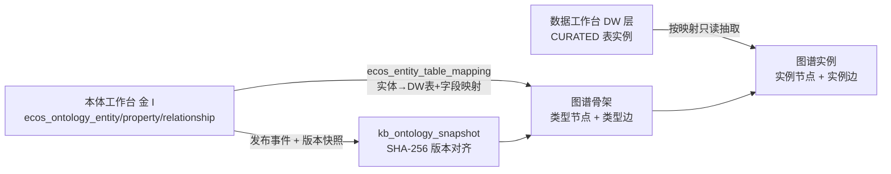
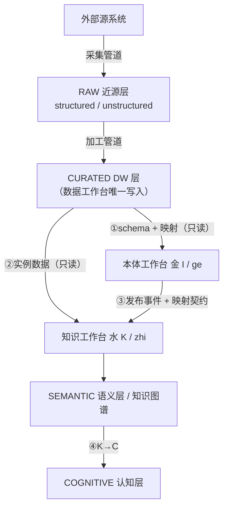

# 知识工作台重新规划方案

> **架构铁律**: 遵循 [架构铁律](../../.trae/rules/架构铁律.md)（§0.2 五对象五行 / §0.3 引擎职责 / §2.1 引擎间只调 API / §2.4 安全接入 / §2.5 runtime 公共底座 / §3.3 跨引擎数据访问）与 [数据湖存储分层规范](../../.trae/rules/数据湖存储分层规范.md)。
> **日期**: 2026-09-19 | **版本**: v2.1（§8 裁决版） | **状态**: 🟢 已批准
> **变更记录**:
> - v1.0 → v2.0：主线由「现状诊断 + 修复路线」改为「**功能设计蓝图**」；篇幅精简至约 200 行；现状诊断与证据压缩为附录 A；15 Tab 映射移入附录 B。
> - v2.0 → v2.1：§8 六个开放问题完成裁决（Q1~Q6）；Q2 结论回写 §2.1、Q5 结论回写附录 B、Q6 纳入 B7 批次。

---

## 0. 执行摘要

三工作台的分工本质是一条**单向数据流水线**：

**数据工作台（土 D）管存储与加工 → 本体工作台（金 I）管模型与映射契约 → 知识工作台（水 K + 木 C）管语义实例化。**

打通三者的关键抓手只有一个：**本体工作台产出的 `ecos_entity_table_mapping`（实体 → DW 表 + 字段映射）**。它既是要求②中「图谱准确基于本体模型生成」的落点，也是要求⑤中「三工作台数据流转」的唯一契约入口。

知识工作台的功能按 **6 个核心模块**（K1 抽取 / K2 融合 / K3 存储 / K4 更新 / K5 查询 / K6 治理）重组，每个模块的输入输出与跨工作台交互方式见 §6。非结构化数据采 **路线 B（经数据工作台结构化）+ A3 过渡**（见 §3）。

---

## 1. 三工作台职责边界（要求①）

| 维度 | 数据工作台（土 D） | 本体工作台（金 I） | 知识工作台（水 K + 木 C） |
|:--|:--|:--|:--|
| **一句话职责** | 数据的**存储与管理** | 业务模型的**定义与关联** | 依据本体模型**抽取数据形成知识图谱** |
| 核心产出 | 近源层对象（RAW）、DW 层表（CURATED）、管道、血缘、DQ | 本体 schema（实体/属性/关系/域）、**实体→DW 表映射契约**、版本快照 | 知识图谱实例、向量索引、抽取候选、知识规则、评估报告 |
| 权威数据 | `td_data_resource` / `td_data_field` / `td_datasource` / DW 业务表 / MinIO 对象 | `ecos_ontology_entity` `_property` `_relationship` / `ecos_domain` / **`ecos_entity_table_mapping`** / `ecos_ontology_version` | `graph_node` / `graph_edge` / `knowledge_article` / `knowledge_embedding` / `kb_ontology_snapshot` / `expert_rule` |
| 转化角色 | 供给方 | **ge 格物**（D→I） | **zhi 致知**（I→K）、cheng 诚意（K→C） |
| 允许读 | 外部源系统、近源层、DW 层 | **仅 DW 层（只读）** | **仅 DW 层（只读）+ 语义层（只读）** |
| 禁止 | 不定义业务语义、不建本体、不建图谱 | 禁直读近源层/外部源；禁写 DW 表；禁建图谱 | 禁直读近源层/外部源；禁写 DW 表；禁改本体 schema |
| 越界判据 | 出现「业务语义定义」「图谱节点」 | 出现 `td_data_*` 查询 | 出现 MinIO 直读 / `td_data_resource` 写 |

**五条边界铁律**（建议纳入架构铁律文档）：

1. **单一事实源**：DW 层表写入权只属数据工作台，本体/知识工作台一律只读。
2. **契约先行**：知识工作台不得自行推断「哪个表对应哪个实体」，必须消费 `ecos_entity_table_mapping`。
3. **语义不上移**：数据工作台不内置业务语义，只做通用存储与加工。
4. **图谱不回写**：知识工作台不得把图谱结果写回 DW 层或本体表；需沉淀为资产则经数据工作台管道重新采集。
5. **映射必校验**：本体工作台保存映射时必须校验 DW 表/列存在性与类型兼容。

---

## 2. 知识工作台 ↔ 本体工作台对接机制（要求②）

### 2.1 对接模型：本体给「骨架 + 契约」，知识填「血肉」

- **骨架层**：每个本体实体类型 → 一个类型记录，每条本体关系 → 一条类型边，由本体发布事件驱动。
- **实例层**：DW 表每行 → 实例节点，外键 → 实例边，由 `ecos_entity_table_mapping` 驱动。**实例化范围（Q2 裁决）**：以映射存在性为准（有映射即可实例化），映射表新增 `materialized` 布尔列（默认 `true`）用于显式关闭。

### 2.2 版本对齐机制

- 图谱节点/边新增溯源列：`ontology_id`、`ontology_version`、`source_resource_id`、`source_pk`。
- **图谱版本 = 本体版本**：以 `kb_ontology_snapshot`（`ontologyId + version + SHA-256`）为对齐基准。
- 本体发布新版本 → 比对事件的 `entityCodes/relationshipCodes` → 计算 **CREATE / UPDATE / DEPRECATE** 增量动作，不整体重建。

### 2.3 一致性校验（构建前 dry-run + 发布后增量）

| # | 校验 | 规则 | 失败处置 |
|:--|:--|:--|:--|
| C1 | 类型存在性 | 图谱节点 `type` ∈ 快照 entity 集合 | 拒绝构建 `UNKNOWN_ENTITY_TYPE` |
| C2 | 关系合法性 | 实例边 `(source_type, relation, target_type)` ∈ 本体关系定义 | 跳过该边 + 告警 |
| C3 | 属性完整性 | 节点属性 ⊆ 本体属性集合；必填缺失 → 告警 | 告警不阻断 |
| C4 | 映射有效性 | 映射指向的 DW 表/列存在且类型兼容 | 拒绝该实体实例抽取 `INVALID_MAPPING` |

校验报告落 `kg_sync_log`，前端 `graph_build` Tab 的 dry-run 预览展示。

### ADR-1: 图谱构建模式选择

| 方案 | 说明 | 评估 |
|:--|:--|:--|
| A. 纯本体驱动 | 只建 schema 骨架，不抽实例 | ❌ 图谱无血肉，无法支撑 RAG/推理 |
| B. 纯数据驱动 | 直接扫 DW 层表猜实体 | ❌ 违反边界铁律 2（契约先行），语义混乱 |
| **C. 契约驱动混合（采纳）** | 骨架由本体事件驱动，实例由映射契约驱动 | ✅ 骨架/血肉分层清晰，本体变更可精确对齐，完全合规 |

---

## 3. 非结构化数据处理策略（要求③）

### 3.1 两条路线

- **路线 A —— 直接构建向量库**：上传 → 解析 → 切 chunk → 嵌入 → 直写知识工作台向量表，不经过数据工作台。
- **路线 B —— 数据工作台结构化处理后再使用**：原文 → 近源层 `raw/unstructured/`（原文不可再生，长期保留）→ 解析为文本 + 元数据 → 落 **DW 层 CURATED 表**（`doc` / `doc_chunk`）→ 知识工作台从 DW 层取数做嵌入与图谱抽取。

### 3.2 对比矩阵

| 维度 | 路线 A：直接建向量库 | 路线 B：经数据工作台结构化 | 裁决 |
|:--|:--|:--|:--:|
| 数据处理效率 | 链路短，首次可用最快 | 多 2 跳（落湖→解析→入 DW） | A 优 |
| 存储需求 | 仅向量 + 原文副本，原文易丢 | 原文 + 文本 + 向量，存储约 ×1.6~2 | A 优 |
| 查询性能 | 路径最短 | 向量延迟相同，但可按 DW 结构化字段**预过滤**，召回更准 | B 略优 |
| 知识提取准确性 | 无 schema 约束，实体命名漂移 | 可按 DW 字段锚定实体，且受 C1~C3 校验约束 | **B 显著优** |
| 可追溯性/审计 | 弱：向量与原文脱钩 | 强：`source_path` + `source_pk` 全链路可回溯 | **B 显著优** |
| 一致性维护 | 文档更新需重嵌入，无水位线 | 复用数据工作台管道增量/CDC 与分层登记 | B 优 |
| 架构合规性 | ❌ 违反分层铁律（绕过 DW 层） | ✅ 完全符合 | **B 唯一合规** |
| 实现成本 | 低（kb 侧已有大半能力） | 高（需补近源层写入 + 解析节点 + DDL） | A 优 |

### 3.3 裁决

**采纳路线 B 为架构基线**——路线 A 违反分层铁律，且牺牲可追溯性与提取准确性，而这两项正是知识工作台的核心价值。**分场景折中**：

| 场景 | 裁决 |
|:--|:--|
| 制度/合同/手册等长生命周期文档 | 强制路线 B 全链路 |
| 高密级/需合规审计文档 | 强制路线 B |
| 会话内一次性临时附件 | 允许路线 A 快路径，须打 `ephemeral=true` 标记并 TTL 清理 |

### ADR-2: 解析器归属

| 方案 | 说明 | 评估 |
|:--|:--|:--|
| A1. 解析下沉数据工作台 | data-engine 新增 `SOURCE_MINIO` + 文档解析节点，「非结构化 → DW 表」成为管道能力 | ✅ **目标态**（职责最清晰，物理写入权归位） |
| A2. 解析留 kb，产物直写 DW 表 | kb-engine 直接 INSERT CURATED 表 | ❌ 违反边界铁律 1（单一事实源） |
| **A3. 过渡折中（采纳）** | 解析暂留 kb-engine 写自有 chunk 表，同时通过数据工作台登记端点把原文与文本登记为数据资源 | ✅ **过渡态**（元数据先行统一，可平滑演进到 A1） |

**结论**：短期采 A3，中期迁 A1；A2 永久否决。A3 技术债退出条件：`SOURCE_MINIO` + 解析节点落地后 1 个批次内退出。

---

## 4. 知识工作台非结构化功能设计（要求④）

| # | 功能 | 输入 | 输出 | 依赖工作台 |
|:--|:--|:--|:--|:--|
| F1 | **文档登记与资产化** | 上传文件 | 近源层 `raw/unstructured/{source}/{docId}/{filename}` + 资源登记（`RAW`/`UNSTRUCTURED`/`LAKE_OBJECT`） | 数据工作台（登记 API） |
| F2 | **解析任务编排** | 已登记文档 | 解析状态机（queued→parsing→extracting→done/failed） | runtime-task（调度） |
| F3 | **文本抽取与分块** | 原文 | `doc_chunk`（文本 + 序号 + 偏移 + 元数据），**落 DW 层表** | 数据工作台（目标态 A1） |
| F4 | **嵌入与向量索引** | `doc_chunk` | 向量列 + HNSW 索引 | llm-gateway（嵌入） |
| F5 | **抽取候选生成** | chunk 文本 + 本体 schema | 候选实体/关系三元组（待审核） | 本体工作台（schema）、ai-engine（LLM） |
| F6 | **候选审核与入图** | 候选三元组 | `graph_node` / `graph_edge` | — |
| F7 | **文档级知识溯源** | 图谱节点 | 反查 `docId → chunk → 原文页码` | 数据工作台（元数据） |
| F8 | **非结构化生命周期** | 文档资产 | draft/active/deprecated/archived + 审计 | security-engine（审计） |

**分块策略**：chunk 切分**不在知识工作台实现**（否则违反「DW 层只读」），应作为数据工作台解析节点的产物落 `doc_chunk` 表；知识工作台只消费。chunkSize/overlap 由数据工作台管道配置。

---

## 5. 三工作台数据流转与接口规范（要求⑤）

### 5.1 流转全景

### 5.2 标准流程 SOP

| SOP | 名称 | 触发 | 步骤 |
|:--|:--|:--|:--|
| SOP-1 | 结构化数据入湖入 DW | 采集管道执行 | 源表 → `raw/structured/...` → 登记（`RAW/STRUCTURED`）→ 管道写 DW 表 → 标记 `layer=CURATED` |
| SOP-2 | 非结构化文档入湖与解析 | 文档上传 | 原文 → `raw/unstructured/...` → 登记（`RAW/UNSTRUCTURED`）→ 解析 → 文本落 DW 表 → 登记 `CURATED` |
| SOP-3 | 本体建模与数据关联 | 本体工作台操作 | 定义实体/属性/关系 → 保存映射（含 C4 校验）→ 生成版本快照 → 发布 |
| SOP-4 | 知识图谱构建 | 本体发布事件 / 手动 | 拉 schema → 落 `kb_ontology_snapshot` → 建骨架 → 按映射抽 DW 实例 → C1~C4 校验 → 写图谱 → 记 `kg_sync_log` |
| SOP-5 | 知识消费 | 用户查询 | 查询改写 → 嵌入（llm-gateway）→ 向量检索 + 图谱扩展 → 安全过滤（RLS/脱敏）→ 生成（LLM） |

### 5.3 接口规范

| 方向 | 端点 / Topic | 说明 | 状态 |
|:--|:--|:--|:--:|
| 本体→知识 | Kafka `KafkaTopics.ONTOLOGY_PUBLISHED` | 本体发布事件（需补全 `entityCodes/relationshipCodes`） | 修正 |
| 本体→知识 | `GET /api/v1/ontology/versions/{version}` | 拉版本快照（schema） | 已有 |
| 本体→知识 | `GET /api/v1/ontology/entity-mappings?ontologyId=` | **映射契约全量**（实例抽取入口） | 新增 |
| 本体→知识 | `POST /api/v1/ontology/mappings/validate` | 保存前校验 C4 | 新增 |
| 数据→知识 | `GET /api/v1/engine/data/layers/{layer}` | 按层列资源（`CURATED`） | 已有 |
| 数据→知识 | `GET /api/v1/datanet/metadata/fields/{id}` | 列定义 | 已有 |
| 数据→知识 | `GET /api/v1/engine/data/layers/{layer}/resources/{id}/rows?watermark=&limit=` | 实例行读取（增量水位线） | 新增 |
| 数据→知识 | `GET /api/v1/engine/data/layers/{layer}/resources/{id}/sample?limit=100` | 抽样（dry-run 用） | 新增 |
| 知识→数据 | `POST /api/v1/datanet/metadata/resources` | 登记数据资源（`layer`/`zone`/`resource_type`/`source_path`） | 新增 |
| 知识→数据 | `POST /api/v1/datanet/datalake/unstructured` | 登记非结构化原文对象 | 新增 |
| 知识→知识 | `POST /api/v1/knowledge/graph/build` + `/preview` | 图谱构建与 dry-run 预览 | 修正 |
| 知识→知识 | `GET /api/v1/knowledge/sync/{status,jobs,logs}` | 同步状态/作业/日志 | 已有 |
| 知识→知识 | `POST /api/v1/knowledge/extract/candidates/{fileId}/approve` | 候选审核入图 | 新增 |

**分层标记责任**：原文 → `RAW/UNSTRUCTURED/LAKE_OBJECT`；解析文本 → `CURATED`；DW→语义 → `SEMANTIC`。标记失败仅记 `warn`，不阻断管道。

---

## 6. 核心功能模块设计（要求⑥）

### 6.1 模块总览与交互矩阵

| 模块 | 输入 | 输出 | 交互对象 |
|:--|:--|:--|:--|
| **K1 知识抽取** | DW 表实例、`doc_chunk`、本体 schema | 候选三元组 / 实体 | 数据工作台（读 DW）、本体工作台（schema+映射）、ai-engine（LLM 抽取） |
| **K2 知识融合** | 候选三元组、既有图谱 | 消歧实体、补全属性、裁决关系 | cognitive-engine（一致性/因果推断）、本体工作台（类型约束） |
| **K3 知识存储** | 融合结果 | 图谱节点/边、向量索引、本体快照 | llm-gateway（嵌入）；无其他工作台写入 |
| **K4 知识更新** | 本体发布事件、DW 增量、定时任务 | 增量图谱变更 + 版本对齐 + 回滚 | 本体工作台（事件）、数据工作台（水位线）、runtime-task（调度） |
| **K5 知识查询** | 用户查询 | 图谱结果 / RAG 答案 | llm-gateway（嵌入+生成）、security-engine（RLS/列过滤/脱敏） |
| **K6 知识治理** | 知识资产 | 生命周期、合规报告、评估报告 | security-engine（OPA 合规裁决） |

### 6.2 各模块功能与交互方式

**K1 知识抽取** — 双通道设计：
- *结构化通道（映射驱动，优先）*：按 `ecos_entity_table_mapping` 直接从 DW 层取行，字段映射即抽取规则，**确定性高、零 LLM 成本**。这是「图谱准确基于本体模型生成」的主力。
- *非结构化通道（LLM 驱动）*：对 `doc_chunk` 走 ai-engine agent-loop 抽取**候选**（非直接入图），须经 K2 融合 + 人工审核。
- 实体链接复用既有能力，但需修正其数据源。
- 交互：读数据工作台（DW 层 REST 只读）→ 读本体工作台（schema + 映射）→ 调 ai-engine（LLM）。**禁止**自建 LLM 调用。

**K2 知识融合**：
- 实体消歧：主键精确匹配 → 名称归一化 → 向量相似度阈值兜底。
- 属性补全：多源取并集；冲突按「来源优先级 > 更新时间 > 置信度」裁决，冲突不覆盖而标记 `conflict=true` 供人工裁决。
- 关系推断：传递闭包在本地；复杂因果推断**委托 cognitive-engine**（kb 不执行规则判定）。
- 交互：调 cognitive-engine `/api/v1/cognitive/*`。

**K3 知识存储**：

| 载体 | 用途 | 要点 |
|:--|:--|:--|
| PG `graph_node` / `graph_edge` | standard 档图谱 | 新增溯源列 `ontology_id`/`ontology_version`/`source_resource_id`/`source_pk` |
| Neo4j | enterprise/ultimate 档（>3 层因果链） | 复用既有写入分支 |
| PG `knowledge_embedding` | 向量 | 新增 `embedding_vec` 向量列 + HNSW 索引（**只加不删**，不动原 JSONB 列） |
| `kb_ontology_snapshot` | 本体快照（版本对齐基准） | 保留 |

**K4 知识更新**：

| 触发源 | 机制 |
|:--|:--|
| 本体发布事件 | `@KafkaListener` 消费 → 比对 `entityCodes` diff → 骨架增量（CREATE/UPDATE/DEPRECATE） |
| DW 层数据变更 | 定时任务（**委托 runtime-task**）按水位线增量抽实例 |
| 手动全量重建 | `POST /api/v1/knowledge/graph/build`（FULL）+ jobId 前缀回滚 |
| 文档更新 | 旧 chunk 标记 `deprecated` → 重嵌入 → 图谱节点 `source_version` 更新 |

版本对齐规则：图谱记录 `ontology_version`；未对齐记录进入「待重建」队列，前端展示对齐进度。

**K5 知识查询**：图谱查询（路径/邻居/搜索）→ 结构化预过滤 → 向量召回 → 图谱邻居扩展 → 重排 → RAG 生成。嵌入与生成统一走 **llm-gateway**；返回前调 **security-engine** 做 RLS / 列过滤 / 脱敏。

**K6 知识治理**：知识资产生命周期（draft/active/deprecated/archived）、合规检查（走 security-engine OPA）、检索质量评估（recall@k / MRR / nDCG）。

### 6.3 横切能力（复用，禁自建）

| 能力 | 归属 | 约束 |
|:--|:--|:--|
| 基础设施访问（PG/Neo4j/MinIO） | `runtime-access` | 禁止 new Driver |
| LLM 调用 | `llm-gateway` | 禁止直连 Provider |
| 任务调度 | `runtime-task` | 禁止自建 `ScheduledExecutorService` |
| 监控告警 | `runtime-monitor` | 禁止自建 |
| 安全（RLS/CLS/脱敏/OPA/审计） | `security-engine` | 禁止重复实现 |
| 审计事件 | Kafka `ecos.audit` | 写操作必发 |

---

## 7. 风险矩阵

| # | 风险 | 概率 | 影响 | 缓解 |
|:--|:--|:--:|:--:|:--|
| R1 | 向量列迁移破坏既有数据 | 中 | 中 | 新增 `embedding_vec` 列 + 双写过渡（只加不删） |
| R2 | 解析器下沉（A1）迁移量大、长期悬空 | 中 | 中 | A3 过渡保证元数据先行统一；A1 设独立批次 |
| R3 | DW 实例抽取引入慢 SQL | 中 | 高 | 强制分页 + 水位线增量 + 索引校验 |
| R4 | 图谱实例化放大存储（每行一节点） | 中 | 中 | 按需实例化（仅本体标记 `materialized=true` 的实体）；超 100 万行切 Doris |
| R5 | 本体频繁发布导致图谱反复重建 | 中 | 中 | 事件去抖（同 ontologyId 5s 合并）+ diff 增量 |
| R6 | 三工作台边界被后续迭代侵蚀 | 中 | 中 | §1 五条边界铁律纳入架构铁律文档 |

---

## 8. 开放问题裁决结果

> 判据：架构一致性 > 低冗余 > 避免过度工程。裁决日期 2026-09-19。

| # | 问题 | 裁决 | 判据 / 约束 |
|:--|:--|:--|:--|
| Q1 | `doc_chunk` DW 层表由谁建 DDL？ | **目标态（A1）：数据工作台**；过渡期（A3）：kb 建自有表 `kb_doc_chunk` 并登记元数据，A1 落地时迁入 DW 层 | 边界铁律 1「单一事实源」——DW 层写入权只属数据工作台 |
| Q2 | 图谱是否对所有本体实体做实例化？ | **按需**：以 `ecos_entity_table_mapping` 存在性为准；映射表新增 `materialized` 布尔列（默认 `true`）用于显式关闭 | 无映射实体（接口/动作等）无 DW 实例来源，强行实例化只产空节点并放大存储（R4） |
| Q3 | DW 层变更如何通知知识工作台？ | **先轮询水位线**，不预先实现 Kafka 事件。触发条件：当「DW 表变更 → 知识可见」时延要求 < 5 分钟时再补事件 | 避免过度工程；轮询满足当前批次需求 |
| Q4 | 图谱骨架是否需「类型节点」？ | **不建独立类型节点**。类型作为节点属性 + 类型索引；本体骨架视图从 `kb_ontology_snapshot` 单独渲染，与实例图谱分层展示 | 类型节点使节点数翻倍且与实例语义混淆；schema 已由本体权威承载，图内再存一份违反低冗余红线 |
| Q5 | Tab 分组是否重排？ | **重排**，但**排期在 B5 功能修复之后**。最终 7 组：`overview` / `ingest`(import,upload,review) / `model`(ontology_model,graph_build,classification) / `store`(vector_index) / `retrieval`(rag,graph_explorer) / `govern`(rules,eval,lifecycle,compliance) / `config`(engine_config) | 分组与 §6 的 K1~K6 模块一一映射；需同步补 `knowledge.group.{store,govern}` i18n 词条 |
| Q6 | 是否同步更新分层规范 §七？ | **更新**，三处：①「前端无分层视图消费方」改为已有消费方；② P4 非结构化缺口按 §3/§4 重述为 A3→A1 路线；③ §1 五条边界铁律并入架构铁律文档 | 规范是「唯一规则出口」，不得与代码事实冲突。✅ **已于 2026-09-19 授权后完成**（见下） |

**Q6 落地记录（2026-09-19）**：

| 文件 | 改动 |
|:--|:--|
| `.trae/rules/数据湖存储分层规范.md` | 版本 → v1.1；§七 移除「前端无分层视图」缺口并新增「已闭合项」说明；非结构化缺口重述为 A3→A1 路线；补 `ontology-engine` 越界直查 `td_data_*` 记录；指向本方案文档 |
| `.trae/rules/架构铁律.md` | 版本 → v1.3；新增 **§0.5 三工作台职责边界铁律**（职责表 + 五条边界铁律） |
| `docs/ARCHITECTURE-RULES.md` | 同步新增 §0.5（该文件为滞后副本，头部已标注「冲突时以工厂副本为准」） |

---

## 附录 A. 现状诊断（缺陷清单）

> 完整证据索引见 v1.0（本版压缩）。以下为阻塞本方案落地的关键缺陷。

| # | 缺陷 | 严重度 | 证据 |
|:--|:--|:--:|:--|
| D1 | 本体发布 → 图谱同步实际产出 0 节点/0 边（读 `ontology_objects`/`object_relationships` 两张**无 DDL 的幻影表**，异常被吞） | 🔴 P0 | `kb-engine-impl/.../kb/service/KgMapperService.java:270,284,275-278` |
| D2 | 实例数据无来源：无「DW 层 CURATED → 知识图谱」抽取链路 | 🔴 P0 | kb-engine 全模块 grep `CURATED\|td_data_resource` 零命中 |
| D3 | `knowledge_embedding.embedding` 为 **JSONB** 非 vector，无向量索引 → RAG 降级 ILIKE | 🔴 P0 | `gateway/src/main/resources/db/migration/V51__ecos_knowledge_graph_vector.sql:19`；`KnowledgeRetrievalServiceImpl.java:140-145,203` |
| D4 | 无 chunk 切分与向量写入生产代码 | 🔴 P0 | 全模块 grep `embeddingMapper.insert` 仅测试类 |
| D5 | 非结构化无生产者：`raw/unstructured` 无写入方，data-engine 无解析能力 | 🟠 P1 | `DataLakeResourceService.java:35`（仅 `markNearSourceStructured`） |
| D6 | 6 个前端端点 404（eval / assets / lifecycle-audit / extract-files / extract-candidates / build-preview） | 🟠 P1 | 全 Java 源码零命中 |
| D7 | 本体发布事件 `entityCodes/relationshipCodes` 为空 → 无增量能力 | 🟠 P1 | `OntologyVersionService.java:177-179` |
| D8 | 本体↔DW 映射（`ecos_entity_table_mapping`）后端无一致性校验 | 🟠 P1 | `OntologyMappingService.java:89-92` |
| D9 | 无图谱↔本体版本对齐机制 | 🟠 P1 | 无 diff/失效标记代码 |
| D10 | 管道无 `SOURCE_MINIO`（无法读近源层）；`SINK_MINIO` 仅 csv 且 key 硬编码 | 🟡 P2 | `PipelineNodeTypesCatalog.java:23-27`；`PipelineExecutionService.java:698-701,725` |
| D11 | ontology-engine 直查 `td_data_field/td_data_resource` 越界 | 🟡 P2 | `AutoDiscoverService.java:177-183` |
| D12 | `SOURCE_CDC` 节点声明未实现 | 🟡 P2 | `PipelineExecutionService.java:271` |

**实施批次建议**（待本方案批准后拆 PMO 指令，每批 ≤5 Task）：

| 批次 | 主题 | 覆盖 | 实施状态（2026-09-19） |
|:--|:--|:--|:--|
| B1 | 图谱骨架修复（读 `kb_ontology_snapshot` 替代幻影表 + 异常不吞） | D1、D9 | ✅ 完成 `73c08fd` |
| B2 | 事件 payload 补全 + 映射校验端点 | D7、D8 | ✅ 完成 `3638a2d` |
| B3 | DW 实例读取端点 + 图谱实例抽取（契约驱动，含 `materialized` 列） | D2、Q2 | ✅ 完成 `2c893c7`（读取侧）+ `ca723ae`（抽取侧） |
| B4 | 向量链路修复（新增 vector 列 + HNSW + chunk 写入） | D3、D4 | ✅ 完成 `42af9c4`；附 `9ebbeb9` 固化 pgvector 扩展挂载 |
| B5 | 非结构化登记链路 + 6 个 404 端点补齐（含 `kb_doc_chunk` 过渡表） | D5、D6、Q1 | ✅ 完成 `db3b003`（A3 登记链路）+ `45fe57d`（端点补齐） |
| B6 | 管道 `SOURCE_MINIO` + 解析节点（A1 目标态） | D5、D10 | 🟡 部分完成：`a625549`（`SOURCE_MINIO` + 格式/分区配置消费）；**解析节点与 `doc`/`doc_chunk` 落 DW 层未实施**（见下「B6-2 待裁决」） |
| B7 | 越界修正 + 规范文档同步（Q6 需单独授权改规则文件） | D11、D12、Q6 | ✅ 完成 `d470e38`（越界归零 + CDC 显式拒绝） |
| B8 | Tab 分组重排（7 组）+ `knowledge.group.{store,govern}` i18n 词条补齐，**排在 B5 之后** | Q5 | ✅ 完成 `ff23c44` |

**B6-2 待裁决（解析节点下沉）**：A1 目标态要求「文档解析节点下沉数据工作台」，但现有解析实现 `DocumentParserService`（Tika / MinerU）位于 `kb-engine-impl`。按架构铁律 §2.1「引擎间只调 API 不调 Impl」，data-engine 不能引用该类；按 §2.5-6「补强而非自建」，正解是**把文档解析能力上移 `runtime-access`** 作为公共基础能力（data-engine 与 kb-engine 共用），代价是向 `runtime-access` 引入 Tika 相关依赖。该动作涉及公共底座依赖变更，需单独裁决后再实施；在此之前 **A3 过渡态（B5 已交付）保持有效**，非结构化链路不受影响。

---

## 附录 B. 15 Tab 重构映射

| Tab | 归属模块 | 处置 |
|:--|:--|:--|
| overview | — | 保留（workspace 聚合层） |
| import | K1 | 重构：去 localStorage 队列，改读 data-engine 元数据 + DW 资源列表 |
| upload | F1/F2 | 重构：补齐非结构化资源登记 + 分片字段后端接收 |
| review | K1/K2 | 修复：补 `/extract/files`、`/extract/candidates` 端点（D6） |
| ontology_model | — | 保留；补 C4 校验入口 |
| graph_build | K4 | 增强：补 `/graph/build/preview`（dry-run + C1~C4 报告） |
| vector_index | K3 | 修复：解 D3/D4 后转真实向量索引管理 |
| classification | K2 | 重构：去掉 `DEMO_CLASSIFICATIONS` |
| rag | K5 | 修复：解 D3 后转真向量检索 |
| graph_explorer | K5 | 保留 |
| rules | K6 | 重构：去掉 `DEMO_RULES` 回退 |
| eval | K6 | 修复：补 `/knowledge/eval/run`（D6） |
| lifecycle | K6 | 修复：补 `/knowledge/assets`、`/knowledge/lifecycle/audit`（D6） |
| compliance | K6 | 保留（OPA 合规检查） |
| engine_config | — | 保留 |

**Tab 分组（Q5 已裁决：重排，排在 B5 之后执行）**：由现 6 组调整为 7 组——`overview` / `ingest`(import,upload,review) / `model`(ontology_model,graph_build,classification) / `store`(vector_index) / `retrieval`(rag,graph_explorer) / `govern`(rules,eval,lifecycle,compliance) / `config`(engine_config)。实施时须同步补 `knowledge.group.{store,govern}` 的 zh-CN/en 词条。
